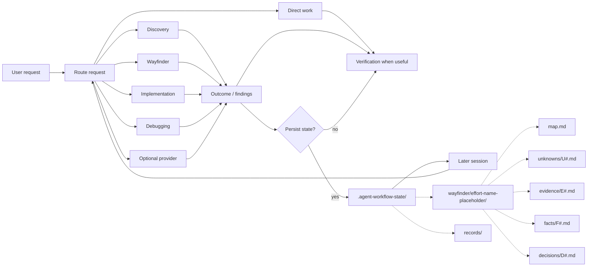

# Agentic Workflow

Agentic Workflow is an experimental stateful workflow layer for coding agents.

It is designed to keep clear, bounded work direct while giving longer-running engineering work a project-owned place to record and resume important state across sessions.

The project started from a practical problem: engineering work rarely happens in one clean session. Questions get investigated, decisions depend on what was learned, implementation exposes new unknowns, work gets blocked, and the project gets picked up again later.

Agentic Workflow explores whether explicitly recording that state can help an agent continue work without depending on the previous chat or session.

This project is pre-1.0 and actively evolving.

## The idea

A lot of engineering work looks something like this:

```text
unknown
   ↓
investigate
   ↓
evidence
   ↓
decision
   ↓
implementation
   ↓
new information
   ↓
continue, reconsider, or create another unknown
```

An agent may handle each individual step in a separate interaction or session.

The problem this project is focused on is preserving the useful connections between those steps.

Agentic Workflow currently combines two mechanisms:

* **Routing** — clear, bounded requests can remain direct; other work can be routed to a relevant workflow.
* **Durable project state** — work that needs continuity can leave behind structured state for later sessions.

The workflow handles the current activity.

The state records what later work may need to know.

## Architecture



The router is intentionally small.

Its job is to classify the request and select a direct route, a dominant workflow, or an optional provider capability.

A clear, bounded task can remain direct and does not need to create durable state.

Other work can use workflows such as Discovery, Wayfinder, Implementation, or Debugging, with supporting capabilities such as Research, TDD, Verification, or Code Review when relevant.

Routing can change as work unfolds. If investigation reveals enough consequential unknowns, decisions, dependencies, blockers, or conflicting facts that ordinary conversational context is becoming unreliable, Agentic Workflow may open or resume a lightweight Wayfinder map automatically. No numeric complexity score or explicit user invocation is required.

Optional provider capabilities can be used when installed and available. If one is unavailable, the framework must not report that it ran.

## Durable project state

Durable state exists when important project context must remain distinguishable
outside ordinary conversational memory, including work likely to continue in a
later session.

It is not intended to store:

* complete chat transcripts;
* hidden reasoning;
* every command the agent tried;
* every failed experiment;
* a general memory of everything the agent has seen.

Instead, project state can record information such as:

* what is known;
* what is still unknown;
* what has been decided;
* why a decision exists;
* what work resulted from it;
* what is blocked;
* what remains actionable; and
* where later work should resume.

The intended source-of-truth order is explicit:

* live source and observed behavior override stale workflow state;
* accepted project artifacts override agent recollection;
* relevant project-owned state provides workflow continuity;
* chat history and private agent memory are not authoritative project state.

## Wayfinder

Wayfinder is the durable planning workflow for efforts where unknowns, decisions, dependencies, and resulting work need to remain connected over time.

The practical threshold is whether a careful engineer would start structured notes now because losing or conflating important state could cause a later mistake. The effort does not have to be huge or certainly multi-session. Explicit Wayfinder requests still select it, explicit opt-outs are respected, and read-only work never creates or updates its state.

A Wayfinder effort can look like:

```text
.agent-workflow-state/
└── wayfinder/
    └── <effort>/
        ├── map.md
        ├── unknowns/
        │   └── U1-example.md
        ├── evidence/
        │   └── E1-example.md
        ├── facts/
        │   └── F1-example.md
        └── decisions/
            └── D1-example.md
```

`map.md` stays intentionally low-resolution. It owns current state, blockers,
dependencies, and next work, with enough context for a fresh session to locate
only the relevant detail. A simple effort is valid with `map.md` alone; all
child directories are optional and created lazily.

Child files are loaded only when needed.

The pinned upstream skill supplies the destination/map/fog methodology. A
narrow, fingerprinted provider adapter makes this Git-native tree authoritative
over upstream tracker mechanics when Agentic Workflow local mode is active. In
that mode no issue tracker or `.scratch/` copy is required.

The vocabulary is:

```text
unknown  = an unresolved consequential question
evidence = a scoped observation or finding with provenance
fact     = a sufficiently established descriptive conclusion
decision = a committed choice
```

This is not a mandatory pipeline. Small facts and observations stay in the map;
U#/E#/F#/D# files exist only when independent preservation adds value. Facts
link their evidence or direct authoritative sources, while conflicting evidence
marks a fact disputed until it is reconciled.

Wayfinder does not create T# work items. One coherent next action can pass from
the map directly to implementation. Work that needs dependency ordering or
separately deliverable sessions goes through `to-tickets`, whose native tickets
remain canonical and are linked from the map without a shadow copy. Older T#
files are preserved as project data but require manual map migration before
resuming under the current contract.

Debugging, Research, Prototype, Grilling, Domain Modeling, human clarification,
or Implementation may resolve or consume an item without taking ownership of
the map.

Wayfinder is not required for every task.

An existing Wayfinder effort should not cause an unrelated, bounded request to enter the Wayfinder workflow.

Starting a map is intentionally cheap: record only what is known, unknown, decided, blocked, and able to proceed, then add detail as the problem develops.

## Re-entry across sessions

Cross-session continuation is one of the main behaviors this project is intended to test.

A target case looks like this:

```text
Session A
─────────
U1: Can the proposed design meet the requirement?
        ↓
investigate
        ↓
U1 resolved
        ↓
D1 created
        ↓
T1 created
        ↓
state persisted


Session B
─────────
new session
        ↓
reads relevant project state
        ↓
recognizes U1 as resolved
        ↓
reads D1
        ↓
continues T1
```

Another case occurs when implementation changes what the project knows:

```text
T1 implementation
        ↓
new constraint discovered
        ↓
U2 created
        ↓
T1 blocked or reconsidered
        ↓
project state updated
        ↓
later work sees U2 as unresolved
```

These are target behaviors, not assumptions that the framework already improves agent performance.

They are part of what the project needs to evaluate.

## Ownership boundary

Agentic Workflow separates reconstructable framework files from durable project-owned state.

```text
target-project/
├── AGENTS.md                    # managed region + preserved project region
├── CLAUDE.md                    # managed region + preserved project region
├── .agents/skills/              # local workflows and optional providers
│
├── .agent-workflow/                # framework-owned and reconstructable
│   ├── install-manifest.json
│   ├── providers.json
│   ├── routing.md
│   ├── contracts/
│   └── templates/
│
└── .agent-workflow-state/          # durable project-owned state
    ├── records/
    ├── archive/
    └── wayfinder/
        └── <effort>/
            ├── map.md
            ├── unknowns/
            ├── evidence/
            ├── facts/
            └── decisions/
```

### `.agent-workflow/`

Framework-owned and reconstructable.

Its contents may be repaired or replaced by the framework.

### `.agent-workflow-state/`

Project-owned.

Durable workflow state lives here and is kept separate from reconstructable framework files.

### `AGENTS.md` and `CLAUDE.md`

These are composite project files.

Agentic Workflow manages only its marked region and preserves project-owned content outside that region.

### Provider artifacts

Provider-native artifacts and identifiers remain canonical in their native locations.

Agentic Workflow references those artifacts rather than creating parallel copies when the provider already owns the information.

For supported hosts, the declared Matt Pocock provider inventory is projected
as a complete set under `.agents/skills/`. Install and update reconcile every
declared skill to the bundled release in one rollback-protected transaction. A
failed provider attempt leaves the independently installed core usable but
reports provider status as incomplete.

## Workflow model

The framework separates **primary workflows** from **supporting capabilities**.

Primary workflows represent the dominant activity for the current work, including:

* Wayfinder
* Discovery
* Specification
* Ticket decomposition
* Implementation

Supporting capabilities can assist those workflows without becoming the dominant workflow themselves, including:

* Research
* Debugging
* Teaching
* TDD
* Verification
* Code Review

The router should select one dominant workflow rather than activating every potentially relevant capability.

Direct work remains a valid route.

## Progressive loading

Agentic Workflow keeps root instructions small and loads detailed workflow guidance and project state only when relevant. Wayfinder follows the same pattern: start from the effort map and load child files as needed.

## Scope

Agentic Workflow is a project-level workflow and state layer, not a coding-agent runtime or general-purpose memory system. Framework files are replaceable; durable project state remains separate and understandable without the framework.

## Prerequisites

Run lifecycle commands in the environment that owns the target project: the
macOS or Linux host Terminal, a VS Code terminal inside a Dev Container, or
native Windows PowerShell. Core installation requires Python 3.11 or newer and
HTTPS access to GitHub.

Check the Python version in that environment:

```bash
# macOS/Linux or a Dev Container
python3 --version
```

```powershell
# Native Windows PowerShell
py -3 --version
```

## Install

From the root of the project where you want to use Agentic Workflow:

```bash
# macOS/Linux or a Dev Container
python3 -c "from urllib.request import urlopen; exec(compile(urlopen('https://raw.githubusercontent.com/jimmfan/agentic-workflow/main/skills/agentic-workflow/scripts/bootstrap.py', timeout=30).read(), 'agentic-workflow-bootstrap.py', 'exec'))"
```

```powershell
# Native Windows PowerShell
py -3 -c "from urllib.request import urlopen; exec(compile(urlopen('https://raw.githubusercontent.com/jimmfan/agentic-workflow/main/skills/agentic-workflow/scripts/bootstrap.py', timeout=30).read(), 'agentic-workflow-bootstrap.py', 'exec'))"
```

Then start a new coding-agent session from the project root so it can discover the installed project instructions and skills.

The current implementation supports Codex and GitHub Copilot project skills through `.agents/skills/`.

A Claude model selected inside GitHub Copilot uses that host's shared skill
projection; this path is supported by the documented host contract and remains
under live compatibility testing. Native Claude Code can use the installed root
policy for classification and host-native work, but the current release does
not project provider skills into `.claude/skills/`.

Installation and lifecycle internals are documented separately.

## Update

Run the matching command from the installed project's root. Update reconciles
the core framework and bundled provider skills while preserving durable project
state under `.agent-workflow-state/`.

```bash
# macOS/Linux or a Dev Container
python3 -c "from urllib.request import urlopen; exec(compile(urlopen('https://raw.githubusercontent.com/jimmfan/agentic-workflow/main/skills/agentic-workflow/scripts/bootstrap.py', timeout=30).read(), 'agentic-workflow-bootstrap.py', 'exec'))" update
```

```powershell
# Native Windows PowerShell
py -3 -c "from urllib.request import urlopen; exec(compile(urlopen('https://raw.githubusercontent.com/jimmfan/agentic-workflow/main/skills/agentic-workflow/scripts/bootstrap.py', timeout=30).read(), 'agentic-workflow-bootstrap.py', 'exec'))" update
```

Append `--dry-run` to preview an install or update without changing the target.
The same bootstrap accepts `status` for a read-only health check and `remove`
to remove reconstructable framework files while preserving project-owned
durable state.

## Experimental status

This project is still an experiment.

The current hypothesis is:

> Can lightweight workflow routing plus durable, project-owned state help coding agents continue long-running engineering work correctly across independent sessions without making straightforward work worse?

The behavioral evaluation is focused on questions such as:

* Can a new session recover where previous work stopped?
* Does it distinguish resolved questions from unresolved ones?
* Does it avoid repeating completed investigation?
* Can it connect decisions to the work they created?
* Does new evidence change the recorded project state and subsequent work?
* Does live repository reality override stale recorded state?
* Do clear, bounded tasks continue to route directly?
* What additional time, context, and token cost does the framework introduce?
* Are any measured improvements large enough to justify that cost?

The architecture may change as those experiments produce evidence.

That is expected for v0.

## Design principles

The current design follows these constraints:

1. **Allow bounded work to remain direct.**
   Clear, bounded requests can route directly and do not require durable workflow state.

2. **Separate framework files from project state.**
   Reconstructable framework files live separately from durable project-owned state.

3. **Do not rely on conversation history for durable continuity.**
   State that needs to survive a session should be represented in project-owned artifacts.

4. **Prefer current project reality over recorded state.**
   Source code, observed behavior, and accepted project artifacts take precedence over stale workflow state.

5. **Persist project-relevant state, not execution history.**
   Durable state should capture information needed to continue the work rather than every action that produced it.

6. **Load detailed instructions and state only when relevant.**
   Root instructions stay compact, and deeper contracts or state files are read as the task requires them.

7. **Keep framework state reconstructable.**
   Removing or rebuilding framework-owned files should not require deleting durable project-owned state.

## More detail

* [Architecture and ownership](docs/architecture.md)
* [Workflow routing](docs/routing.md)
* [Behavioral testing](docs/behavioral-testing.md)
* [Verification](docs/verification.md)
* [Provider research](docs/provider-research.md)

## Acknowledgments

Agentic Workflow uses [Matt Pocock's Skills for Real Engineers](https://github.com/mattpocock/skills) as an optional provider and has been influenced by its emphasis on small, composable agent skills that are loaded only when relevant.

Agentic Workflow's routing, durable project state, Wayfinder model, and cross-session continuity are separate experiments and are not part of Matt's skills project.

Agentic Workflow is available under the [MIT License](LICENSE).
