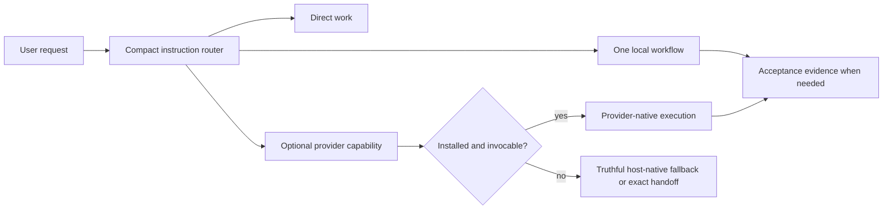

# Agentic Workflow

Agentic Workflow installs a compact project-level intent router for Codex,
GitHub Copilot, and compatible instruction-driven agents. It solves the problem
of applying heavyweight process to every request: clear, bounded work stays
direct, while consequential work loads only the workflow or optional provider
capability it needs.

This is a pre-1.0 experimental project. The router and workflows are the product;
the surrounding lifecycle exists only to install them without destroying
project-owned data.

The v0 design deliberately has no daemon, lifecycle controller, hook layer,
telemetry pipeline, provider ownership database, or runtime package-integrity
gate. The successful outcome is a small router that remains usable when optional
providers are absent and an installer that can reconstruct framework files
without risking project-owned state.

## Runtime model



Routing is instruction-driven. The root policy selects the minimum useful route,
preserves the user's authorization boundary, and never claims an unavailable
provider ran. Provider artifacts and identifiers remain canonical in their
native locations. Durable workflows resume from their canonical record or map;
there is no global active index. Local Wayfinder efforts use the canonical
project-owned tree under `.ai-workflow-state/wayfinder/`, loaded only when
relevant. A compact optional marker such as
`[route: router -> implement -> verification]` is sufficient route visibility.

Codex and GitHub Copilot discover project skills in `.agents/skills`. Claude can
use the root policy for classification and host-native work, but this release
does not project skills into `.claude/skills`.

## Ownership boundary

```text
target-project/
├── AGENTS.md                    # managed region + preserved project region
├── CLAUDE.md                    # managed region + preserved project region
├── .agents/skills/              # required local skills; optional providers
├── .ai-workflow/                # disposable, fully reconstructable framework
│   ├── install-manifest.json    # version, revision, external/composite evidence
│   ├── providers.json
│   ├── routing.md
│   ├── contracts/
│   └── templates/
└── .ai-workflow-state/          # durable project-owned state; never inventoried
    ├── records/                 # optional DEC/IMP/DBG records with resume targets
    ├── archive/                 # completed/superseded record history
    └── wayfinder/<effort>/      # optional canonical map and U#/D#/T# children
```

`.ai-workflow/` is framework-owned. Install and update may replace the whole
directory with the current desired files; a missing or edited framework file is
repairable, not evidence of corruption. `.ai-workflow-state/` and everything
under it are project-owned. Lifecycle operations create the directory when
needed but never seed, checksum, enumerate, rewrite, or remove its contents.

Wayfinder state is created only for a genuinely relevant durable planning
effort. Its map stays low resolution, child files load progressively, and an
unrelated existing effort never turns a simple request into Wayfinder work.

`AGENTS.md` and `CLAUDE.md` are composite files. Only the unambiguous marked
managed region is replaced; bytes outside it survive update and removal.
Unknown content at another required external path is preserved and blocks the
write. The install manifest keeps hashes only for external-file deletion safety.

## Prerequisites

Run lifecycle commands in the environment that owns the project: the **macOS or
Linux host Terminal**, a **VS Code terminal inside the Dev Container**, or
**native Windows PowerShell**. Do not run a host command when the project lives
only inside a container, or vice versa.

Core installation requires Python 3.11 or newer and HTTPS access to GitHub for
the public bootstrap. Optional curated providers additionally require a GitHub
CLI build that exposes `gh skill install` and an authenticated GitHub session.
Provider prerequisites never block the core router.

These read-only checks verify the local tools. Run the matching block in the
same environment that owns the target project:

```bash
# macOS/Linux host Terminal or VS Code terminal inside a Dev Container
python3 --version
gh --version
gh skill install --help
gh auth status --hostname github.com
```

```powershell
# Native Windows PowerShell
py -3 --version
gh --version
gh skill install --help
gh auth status --hostname github.com
```

If optional-provider authentication is missing and you want those skills, run
this persistent login in that same environment:

```bash
gh auth login --hostname github.com --web
```

The login stores a GitHub CLI credential. Reverse it with
`gh auth logout --hostname github.com`; the core framework is unaffected.

## Install

The public bootstrap resolves an immutable Git commit, bounds and validates the
downloaded archive, then runs current-state reconciliation. Run it from the
**target project's root directory**. Installation persistently writes the paths
shown above and then makes a best-effort attempt to install missing optional
providers.

On a macOS/Linux host Terminal or a VS Code terminal inside a Dev Container:

```bash
python3 -c "from urllib.request import urlopen; exec(compile(urlopen('https://raw.githubusercontent.com/jimmfan/agentic-workflow/main/skills/agentic-workflow/scripts/bootstrap.py', timeout=30).read(), 'agentic-workflow-bootstrap.py', 'exec'))"
```

On native Windows PowerShell:

```powershell
py -3 -c "from urllib.request import urlopen; exec(compile(urlopen('https://raw.githubusercontent.com/jimmfan/agentic-workflow/main/skills/agentic-workflow/scripts/bootstrap.py', timeout=30).read(), 'agentic-workflow-bootstrap.py', 'exec'))"
```

A successful core install reports that current framework state was reconciled,
durable project state was preserved, and core routing is ready. Optional-provider
warnings may also appear; they do not change core success.

Open a fresh task from the project root so the host discovers the new policy and
skills.

## Lifecycle operations

These commands use the same validated bootstrap. Run them from the **target
project root** in its owning environment. `update` and `remove` are persistent;
`status` is read-only. `--dry-run` previews install, update, or remove without
changing files.

```bash
# macOS/Linux host Terminal or VS Code terminal inside a Dev Container
python3 -c "from urllib.request import urlopen; exec(compile(urlopen('https://raw.githubusercontent.com/jimmfan/agentic-workflow/main/skills/agentic-workflow/scripts/bootstrap.py', timeout=30).read(), 'agentic-workflow-bootstrap.py', 'exec'))" update
python3 -c "from urllib.request import urlopen; exec(compile(urlopen('https://raw.githubusercontent.com/jimmfan/agentic-workflow/main/skills/agentic-workflow/scripts/bootstrap.py', timeout=30).read(), 'agentic-workflow-bootstrap.py', 'exec'))" status
python3 -c "from urllib.request import urlopen; exec(compile(urlopen('https://raw.githubusercontent.com/jimmfan/agentic-workflow/main/skills/agentic-workflow/scripts/bootstrap.py', timeout=30).read(), 'agentic-workflow-bootstrap.py', 'exec'))" remove
```

```powershell
# Native Windows PowerShell
py -3 -c "from urllib.request import urlopen; exec(compile(urlopen('https://raw.githubusercontent.com/jimmfan/agentic-workflow/main/skills/agentic-workflow/scripts/bootstrap.py', timeout=30).read(), 'agentic-workflow-bootstrap.py', 'exec'))" update
py -3 -c "from urllib.request import urlopen; exec(compile(urlopen('https://raw.githubusercontent.com/jimmfan/agentic-workflow/main/skills/agentic-workflow/scripts/bootstrap.py', timeout=30).read(), 'agentic-workflow-bootstrap.py', 'exec'))" status
py -3 -c "from urllib.request import urlopen; exec(compile(urlopen('https://raw.githubusercontent.com/jimmfan/agentic-workflow/main/skills/agentic-workflow/scripts/bootstrap.py', timeout=30).read(), 'agentic-workflow-bootstrap.py', 'exec'))" remove
```

`update` replaces `.ai-workflow/`, repairs recorded external integrations, and
attempts only missing providers. `remove` strips managed policy regions, deletes
only unchanged external files recorded as framework-created, removes
`.ai-workflow/`, and preserves all provider directories because v0 intentionally
keeps no provider ownership database.

To reverse the core installation, use `remove`. If you also want to delete an
optional provider skill, inspect and remove its `.agents/skills/<name>` directory
manually; automatic deletion would require ownership machinery that v0 declines
to maintain. `.ai-workflow-state/` remains intentionally untouched and may be
deleted only by the project owner after reviewing its contents.

## Migration behavior

Install and update recognize only four development-era durable locations:

- `.ai-workflow/project-profile.md`
- `.ai-workflow/state/active.md` -> `.ai-workflow-state/legacy-active.md`
- `.ai-workflow/state/records/`
- `.ai-workflow/state/archive/`

A missing source is normal. An absent canonical destination receives the bytes;
an identical destination reconciles safely; conflicting content or an unsafe
path stops before mutation and preserves both copies. `legacy-active.md` is
preserved historical data and is not used for routing or resume. Historical framework files,
including `.ai-workflow/state/README.md`, are irrelevant to current desired state
and are never required or recreated.

## Safety and verification

The runtime keeps only safeguards tied to data loss or reliable routing:

- reject filesystem-root targets, target-path symlinks, unsafe archive paths,
  links, special entries, duplicates, corrupt archives, and excessive archives;
- stage and replace reconstructable framework state, with rollback around
  external/composite mutations;
- preserve malformed composite policies and unknown external collisions;
- migrate only named durable state and stop on a byte conflict; and
- isolate optional provider failure from core lifecycle success.

The distribution manifest is an explicit source-to-target install map, not a
payload checksum inventory. Maintainers verify that map from the **source
repository root** with this read-only command:

```bash
python3 skills/agentic-workflow/scripts/verify_package.py --tests
```

Success ends with `OK: Agentic Workflow package verification passed.` Ordinary
edits to an already mapped payload file require no metadata refresh. If the gate
reports a stale manifest after adding, removing, or remapping a packaged file—or
after a version change—review the diff and then run this persistent map refresh
from the same directory:

```bash
python3 skills/agentic-workflow/scripts/verify_package.py --refresh-manifest --tests
```

Revert an unwanted refresh with your version-control restore command for
`skills/agentic-workflow/payload/distribution/manifest.json`. If verification
still fails, the first useful diagnostic is the first reported failed test or
contract, not a runtime reinstall.

The current framework release is `0.11.1`; the optional provider declaration is
pinned to `mattpocock/skills` `v1.2.3`.

See [Architecture and ownership](docs/architecture.md),
[Workflow routing](docs/routing.md), [Verification](docs/verification.md),
[Behavioral testing](docs/behavioral-testing.md), and
[Provider research](docs/provider-research.md). Agentic Workflow is available
under the [MIT License](LICENSE).
