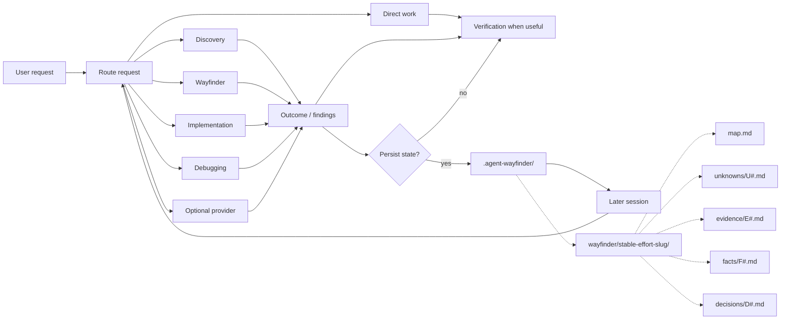

# Agent Workflow

Agent Workflow is an experimental stateful workflow layer for coding agents.

It is designed to keep clear, bounded work direct while giving longer-running engineering work a project-owned place to record and resume important state across sessions.

The project started from a practical problem: engineering work rarely happens in one clean session. Questions get investigated, decisions depend on what was learned, implementation exposes new unknowns, work gets blocked, and the project gets picked up again later.

Agent Workflow explores whether explicitly recording that state can help an agent continue work without depending on the previous chat or session.

Its core goal is to preserve the material context that humans and later agents
need to make or evaluate responsible project decisions. Dependent work should
not cross an unresolved consequential decision boundary, while unrelated ready
work remains free to proceed.

This project is pre-1.0 and actively evolving.

## Quick Start

Install the persistent CLI from the repository, then install Agent Workflow in
the current project:

```bash
uv tool install git+https://github.com/jimmfan/agentic-workflow.git
agent-workflow install
```

The same command manages the installed framework:

```bash
agent-workflow update
agent-workflow status
agent-workflow remove
```

Each lifecycle command uses the current directory by default and accepts an
optional project path.

### Start with Wayfinder

Open the project root in VS Code, start a new GitHub Copilot Chat, and paste the
prompt below. If you already know the specific effort you want to map, replace
"the repository's current development effort" with that goal.

```text
Use the installed Agent Workflow and explicitly start Wayfinder for this
repository's current development effort.

First inspect the project instructions, relevant accepted architecture
decisions and documentation, repository structure, current Git state, and the
source and tests relevant to the effort. Then create a lightweight
`.agent-wayfinder/<stable-effort-name>/map.md` that will help developers and
future agents resume the work without depending on this chat.

Record only durable, evidence-backed coordination context:

- the goal and scope boundary;
- the important areas and relationships in the effort;
- established facts with pointers to their authoritative sources;
- consequential unknowns, decisions, dependencies, and blockers; and
- a concise ready frontier describing what can happen next.

Create linked unknown, evidence, fact, or decision files only when the detail
needs independent provenance or would make the map difficult to scan. Treat
live source and accepted project artifacts as more authoritative than
assumptions, chat history, or stale Wayfinder state. Do not copy the transcript,
invent requirements, or implement product changes during this first pass.

If the current effort cannot be inferred confidently, ask me one concrete scope
question before creating the Wayfinder state. When finished, summarize what you
created, what remains uncertain, and the best next prompt for continuing the
work.
```

## The idea

A lot of engineering work looks something like this:

```text
unknown
   ↓
investigate
   ↓
evidence
   ↓
decision
   ↓
implementation
   ↓
new information
   ↓
continue, reconsider, or create another unknown
```

An agent may handle each individual step in a separate interaction or session.

The problem this project is focused on is preserving the useful connections between those steps.

Agent Workflow currently combines two mechanisms:

* **Routing** — clear, bounded requests can remain direct; other work can be routed to a relevant workflow.
* **Durable project state** — work that needs continuity can leave behind structured state for later sessions.

The workflow handles the current activity.

The state records what later work may need to know.

## Architecture



The router is intentionally small and Direct-first.

Its job is to classify from intent and installed skill descriptions, select a
direct route or one dominant workflow, and load detailed routing only when real
ambiguity, composition, provider fallback, or durable-resume ownership requires
it.

A clear, bounded task can remain direct and does not need to create durable state.

Other work can use workflows such as Discovery, Wayfinder, Implementation, or Debugging, with supporting capabilities such as Research, TDD, Verification, or Code Review when relevant.

Routing can change as work unfolds. Three meaningful items prompt a Wayfinder
assessment, not automatic selection. A hard continuity, conflict, authority, or
provenance signal—or at least two softer interaction, dependency, plan-change,
or reconstruction signals—may justify a lightweight durable map. This is not a
weighted complexity score, and explicit invocation is not required.

Optional provider capabilities can be used when installed and available. If one is unavailable, the framework must not report that it ran.

## Durable project state

Durable state exists when important project context must remain distinguishable
outside ordinary conversational memory, including work likely to continue in a
later session.

It is not intended to store:

* complete chat transcripts;
* hidden reasoning;
* every command the agent tried;
* every failed experiment;
* a general memory of everything the agent has seen.

Instead, project state can record information such as:

* what is known;
* what is still unknown;
* what has been decided;
* why a decision exists;
* what work resulted from it;
* what is blocked;
* what remains actionable; and
* where later work should resume.

The intended source-of-truth order is explicit:

* live source and observed behavior override stale workflow state;
* accepted project artifacts override agent recollection;
* relevant project-owned state provides workflow continuity;
* chat history and private agent memory are not authoritative project state.

## Wayfinder

Wayfinder is the durable planning workflow for efforts where unknowns, decisions, dependencies, and resulting work need to remain connected over time.

The practical threshold is whether a careful engineer would start structured notes now because losing or conflating important state could cause a later mistake. The effort does not have to be huge or certainly multi-session. Explicit Wayfinder requests still select it, explicit opt-outs are respected, and read-only work never creates or updates its state.

A Wayfinder effort can look like:

```text
.agent-wayfinder/
└── <effort>/
    ├── map.md
    ├── unknowns/
    │   └── U1-example.md
    ├── evidence/
    │   └── E1-example.md
    ├── facts/
    │   └── F1-example.md
    └── decisions/
        └── D1-example.md
```

`map.md` stays intentionally low-resolution. It owns current state, blockers,
dependencies, and next work, with enough context for a fresh session to locate
only the relevant detail. A simple effort is valid with `map.md` alone; all
child directories are optional and created lazily.

Child files are loaded only when needed.

Agent Workflow's effective Wayfinder is a framework-owned runtime projection
derived from Matt Pocock's pinned Wayfinder methodology. The unchanged upstream
snapshot remains reviewed provenance and reference; the effective runtime owns
the Git-native map, effort-selection, continuation, U/E/F/D, and `to-tickets`
contracts and contains no appended tracker implementation.

The map gives low-resolution semantic bearings: destination, scope boundary,
major coherent areas, and important relationships or seams. Existing
authoritative project structure is reused; when those bearings are genuinely
unclear, Domain Modeling is the preferred discovery mechanism before substantial
child state accumulates. The map organizes the territory, while U/E/F/D classify
current knowledge within it.

Establish the destination and enough relevant territory to orient the effort
before substantial decomposition.

Territory is provisional, adaptive, and judgment-based. It helps Wayfinder
explore relevant areas and seams, challenge incomplete framing, and revise its
understanding as evidence develops. Exploration may broaden understanding, but
must not silently broaden the user's goal, delegated authority, or
implementation scope.

The map H1 is the durable readable effort name. A new effort derives its name
and concise lowercase, hyphen-separated directory slug only after its destination
and boundary are understood; later sessions list directory names and read only
plausible candidate maps. The established path stays stable even if wording or
implementation phases change. Ambiguous matches remain read-only until resolved.

A map may identify its effort as `current`, `completed`, `abandoned`, or
`superseded`. Likely resume prefers a current match over similarly named
historical work, while a directly named historical effort remains readable at
its stable path. Existing maps without an explicit status remain valid and are
classified only when their outcome and next work make the lifecycle clear.

The vocabulary is:

```text
unknown  = a precise unresolved question worth independent preservation
evidence = a scoped observation with provenance and limitations
fact     = a sufficiently established descriptive conclusion
decision = a committed choice
```

This is not a mandatory pipeline. Small facts and observations stay in the map;
U#/E#/F#/D# files exist only when independent preservation adds value. Facts
link their evidence or direct authoritative sources, while conflicting evidence
marks a fact disputed until it is reconciled.

A precise question becomes U# when preserving the question or its eventual
answer could materially improve a later developer’s ability to make or evaluate
a decision. Authority-owned questions, external approvals, and questions that
gate multiple downstream areas are strong signals. Precision alone is not:
incidental and easily reconstructed fog stays in the canonical map.

The resolution method determines what evidence or authority is sufficient to
answer the question. Existing authoritative evidence can satisfy the method
without a ceremonial specialist run, but research cannot replace a human
authority answer and prose cannot replace required observed or experimental
evidence. Durable Wayfinder state can record authority; it cannot create
authority.

When an unknown resolves, the answer and map are reconciled without requiring a
new evidence, fact, or decision child. U/E/F/D files leave current Wayfinder
state when they no longer retain independent navigational value. Their numbers
remain stable while current, but retirement releases them for the ordinary
highest-current-ID-plus-one rule; Git preserves historical states that actually
enter Git. Retirement requires current information and references to be
reconciled, not a prior commit of the retiring child. One empty transient
per-effort lock serializes map and child mutations so allocation cannot collide
and retirement cannot race a current-reference edit; it contains no knowledge
or allocation data.

An area is settled when it has no consequential uncertainty left undispositioned
and its durable outcomes have moved to the proper canonical owner or workflow.
That may be an ADR, specification, documentation or source, `to-tickets`,
Implementation, another project artifact, or no separate artifact. Not every
area becomes an ADR or ticket. As areas settle, Wayfinder retires redundant
children; completed efforts normally shrink toward a concise map, with Git
preserving history.

Bare references such as `U17`, `F8`, or `D4` are concise shorthand only inside
their current Wayfinder effort. Readable child filenames remain the canonical
paths. ADRs, specifications, tickets, and other artifacts outside the effort use
repository-relative Markdown links with readable labels when a reference must
remain durable beyond the current Wayfinder representation.

Wayfinder does not own implementation work items. When evidence supports it, the
map concisely shows the critical path, independent parallel work, and material
off-path lead-time dependencies; it never invents a critical path from an
unordered backlog. The ready frontier contains coherent scopes whose material
decision dependencies are answered or explicitly dispositioned. Answer each
consequential U#, or canonically record the responsible authority's acceptance
of the remaining uncertainty for that boundary; acceptance does not fabricate
an answer or resolve the U#. One or more independently ready scopes may pass to
implementation without advancing dependency-blocked work. Each Implementation
handoff remains one coherent scope. Work needing a substantial execution graph
or separately deliverable sessions goes through `to-tickets`, whose native
tickets remain canonical and are linked from the map.

Discovery, Debugging, Research, Prototype, Grilling, Domain Modeling, or human
clarification may resolve an item without taking ownership of the map.
Implementation consumes a ready scope as an execution handoff; it is not a
Wayfinder reasoning mechanism or continuity record.

Domain Modeling can sharpen concepts, terminology, boundaries, relationships,
assumptions, and dependencies; Wayfinder preserves only the consequential
durable results. When progress depends on human or project authority, the agent
asks the concrete question, explains why that authority is required, and states
what the answer will unblock instead of assuming a decision.

Wayfinder is not required for every task.

An existing Wayfinder effort should not cause an unrelated, bounded request to enter the Wayfinder workflow.

Starting a map is intentionally cheap: record only what is known, unknown, decided, blocked, and able to proceed, then add detail as the problem develops.

## Re-entry across sessions

Cross-session continuation is one of the main behaviors this project is intended to test.

A target case looks like this:

```text
Session A
─────────
U1: Can the proposed design meet the requirement?
        ↓
investigate
        ↓
U1 resolved
        ↓
D1 created
        ↓
smallest next work recorded in map.md
        ↓
state persisted


Session B
─────────
new session
        ↓
reads relevant project state
        ↓
recognizes U1 as resolved
        ↓
reads D1
        ↓
continues the map's next work
```

Another case occurs when implementation changes what the project knows:

```text
implementation of map.md next work
        ↓
new constraint discovered
        ↓
U2 created
        ↓
next work blocked or reconsidered
        ↓
project state updated
        ↓
later work sees U2 as unresolved
```

These are target behaviors, not assumptions that the framework already improves agent performance.

They are part of what the project needs to evaluate.

## Ownership boundary

Agent Workflow separates reconstructable framework files from durable project-owned state.

```text
target-project/
├── AGENTS.md                    # managed region + preserved project region
├── CLAUDE.md                    # managed region + preserved project region
├── .agents/skills/              # local workflows and optional providers
│
├── .agent-workflow/                # framework-owned and reconstructable
│   ├── install-manifest.json
│   ├── providers.json
│   ├── routing.md
│   └── contracts/
│
└── .agent-wayfinder/          # durable project-owned state
    └── <effort>/
        ├── map.md
        ├── unknowns/
        ├── evidence/
        ├── facts/
        └── decisions/
```

Legacy `DEC`, `IMP`, and `DBG` files under project-owned state remain untouched
historical data. Current workflows neither allocate nor resume them.

### `.agent-workflow/`

Framework-owned and reconstructable.

Its contents may be repaired or replaced by the framework.

### `.agent-wayfinder/`

Project-owned.

Durable workflow state lives here and is kept separate from reconstructable framework files.

### `AGENTS.md` and `CLAUDE.md`

These are composite project files.

Agent Workflow manages only its marked region and preserves project-owned content outside that region.

### Provider artifacts

Provider-native artifacts and identifiers remain canonical in their native locations.

Agent Workflow references those artifacts rather than creating parallel copies when the provider already owns the information.

For supported hosts, the declared Matt Pocock provider inventory is projected
as a complete set under `.agents/skills/`. Install and update reconcile every
declared skill to the bundled release in one rollback-protected transaction. A
failed provider attempt leaves the independently installed core usable but
reports provider status as incomplete.

## Workflow model

The framework separates **primary workflows** from **supporting capabilities**.

Primary workflows represent the dominant activity for the current work, including:

* Wayfinder
* Discovery
* Specification
* Ticket decomposition
* Implementation

Supporting capabilities can assist those workflows without becoming the dominant workflow themselves, including:

* Research
* Debugging
* Teaching
* TDD
* Verification
* Code Review

The router should select one dominant workflow rather than activating every potentially relevant capability.

Direct work remains a valid route.

## Progressive loading

Agent Workflow keeps root instructions small and loads detailed workflow guidance and project state only when relevant. Wayfinder follows the same pattern: start from the effort map and load child files as needed.

## Scope

Agent Workflow is a project-level workflow and state layer, not a coding-agent runtime or general-purpose memory system. Framework files are replaceable; durable project state remains separate and understandable without the framework.

## Prerequisites

Install with `uv` in a POSIX-style shell in the environment that owns the target
project: Bash or Zsh on macOS, Linux, WSL, or a Linux-based devcontainer. Native
PowerShell and CMD are not supported; Git Bash on native Windows is best-effort.
Installation requires HTTPS access to GitHub. The package requires Python 3.11
or newer; `uv` manages the tool environment.

## Install

From the root of the project where you want to use Agent Workflow:

```bash
agent-workflow install
```

Use `agent-workflow install /path/to/project` for an explicit target. Install
and update also accept `--dry-run` and `--ref`; run `agent-workflow --help` for
the complete command syntax.

Then start a new coding-agent session from the project root so it can discover the installed project instructions and skills.

The current implementation supports Codex and GitHub Copilot project skills through `.agents/skills/`.

A Claude model selected inside GitHub Copilot uses that host's shared skill
projection; this path is supported by the documented host contract and remains
under live compatibility testing. Native Claude Code can use the installed root
policy for classification and host-native work, but the current release does
not project provider skills into `.claude/skills/`.

Installation and lifecycle internals are documented separately.

## Update

Run the matching command from the installed project's root. Update reconciles
the core framework and bundled provider skills while preserving durable project
state under `.agent-wayfinder/`.

```bash
agent-workflow update
```

Append `--dry-run` to preview an install or update without changing the target.
Use `agent-workflow status` for a read-only health check and
`agent-workflow remove` to remove reconstructable framework files while
preserving project-owned durable state.

## Experimental status

This project is still an experiment.

The current hypothesis is:

> Can lightweight workflow routing plus durable, project-owned state help coding agents continue long-running engineering work correctly across independent sessions without making straightforward work worse?

The behavioral evaluation is focused on questions such as:

* Can a new session recover where previous work stopped?
* Does it distinguish resolved questions from unresolved ones?
* Does it avoid repeating completed investigation?
* Can it connect decisions to the work they created?
* Does new evidence change the recorded project state and subsequent work?
* Does live repository reality override stale recorded state?
* Do clear, bounded tasks continue to route directly?
* What additional time, context, and token cost does the framework introduce?
* Are any measured improvements large enough to justify that cost?

The architecture may change as those experiments produce evidence.

That is expected for v0.

## Design principles

The current design follows these constraints:

1. **Allow bounded work to remain direct.**
   Clear, bounded requests can route directly and do not require durable workflow state.

2. **Separate framework files from project state.**
   Reconstructable framework files live separately from durable project-owned state.

3. **Do not rely on conversation history for durable continuity.**
   State that needs to survive a session should be represented in project-owned artifacts.

4. **Prefer current project reality over recorded state.**
   Source code, observed behavior, and accepted project artifacts take precedence over stale workflow state.

5. **Persist project-relevant state, not execution history.**
   Durable state should capture information needed to continue the work rather than every action that produced it.

6. **Load detailed instructions and state only when relevant.**
   Root instructions stay compact, and deeper contracts or state files are read as the task requires them.

7. **Keep framework state reconstructable.**
   Removing or rebuilding framework-owned files should not require deleting durable project-owned state.

## More detail

* [Architecture and ownership](docs/architecture.md)
* [Workflow routing](docs/routing.md)
* [Behavioral testing](docs/behavioral-testing.md)
* [Verification](docs/verification.md)
* [Provider research](docs/provider-research.md)
* [Focused Wayfinder VS Code experiment history](docs/focused-wayfinder-vscode-experiment-history.md)

## Acknowledgments

Agent Workflow uses [Matt Pocock's Skills for Real Engineers](https://github.com/mattpocock/skills) as an optional provider and has been influenced by its emphasis on small, composable agent skills that are loaded only when relevant.

Agent Workflow's routing, durable project state, Wayfinder model, and cross-session continuity are separate experiments and are not part of Matt's skills project.

Agent Workflow is available under the [MIT License](LICENSE).
