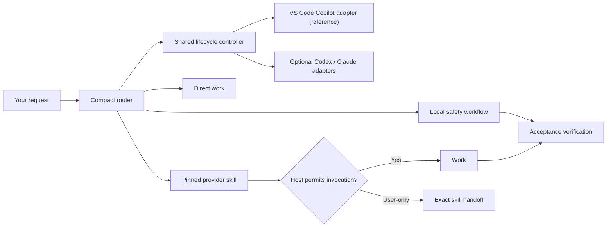

# Agentic Workflow

Agentic Workflow adds a compact project-level router and lifecycle guardrails to
GitHub Copilot in VS Code, OpenAI Codex, and compatible instruction-driven
hosts. You ask for work normally; it keeps simple requests direct and routes
larger work through curated, pinned skills.

## How it works



The router chooses the smallest useful workflow based on the request, risk, and
uncertainty. Provider skills keep their native methods and artifacts. A small
shared controller checks observable lifecycle invariants where host hooks run;
the instruction contract remains functional when hooks are unavailable.

For example:

> Implement ready ticket ARC-384, preserve API compatibility, and do not commit.

The router selects the implementation path, preserves the ticket identifier and
the no-commit boundary, and ends meaningful project changes with verification.
If the selected provider skill requires explicit invocation, Codex returns the
exact `$skill-name` handoff and Copilot returns `/skill-name` instead of claiming
the skill ran.

## Supported hosts

| Host | Support |
|---|---|
| GitHub Copilot in VS Code | Primary/reference host. Router and project skills plus an active **Preview** hook adapter; user-only skills use `/skill-name`. Hooks may be disabled, so instruction fallback remains complete. |
| OpenAI Codex | Strong secondary host. Router and project skills; optional hook template; user-only skills use `$skill-name`. |
| Claude Code | Compatibility target. Root-policy classification and direct work; optional hook template; project skills are not projected into `.claude/skills`. |
| GitHub Copilot CLI/cloud agent | The versioned reference file is structurally discoverable, but runtime guarantees differ and are not release-validated; instruction fallback remains. |

## Prerequisites

Run every command in the environment that owns the target project: the macOS or
Linux host terminal, the VS Code terminal inside a Dev Container, or native
Windows PowerShell. Installation requires:

- Python 3.11+
- GitHub CLI 2.97.0 or newer with `gh skill`
- an authenticated GitHub.com CLI session
- HTTPS access to GitHub

Git is recommended for recovery but is not required. Use the official
[Python downloads](https://www.python.org/downloads/) and
[GitHub CLI installation guide](https://github.com/cli/cli#installation) if a
prerequisite is missing.

In the same terminal that owns the project, verify the prerequisites. These
checks are read-only:

```bash
# macOS, Linux, or a Dev Container
python3 --version
gh --version
gh skill install --help
gh auth status --hostname github.com
```

```powershell
# Native Windows PowerShell
py -3 --version
gh --version
gh skill install --help
gh auth status --hostname github.com
```

If the authentication check fails, this command opens GitHub's login flow and
persistently stores the resulting credential:

```bash
gh auth login --hostname github.com --web
```

## Install

Run the appropriate command from the ordinary project directory that should
become the project root. Installation is persistent: it adds the framework
policy, project skills, manifests, and initial workflow state shown below.

On macOS, Linux, or inside a Dev Container:

```bash
python3 -c "from urllib.request import urlopen; exec(compile(urlopen('https://raw.githubusercontent.com/jimmfan/agentic-workflow/main/skills/agentic-workflow/scripts/bootstrap.py', timeout=30).read(), 'agentic-workflow-bootstrap.py', 'exec'))"
```

On native Windows PowerShell:

```powershell
py -3 -c "from urllib.request import urlopen; exec(compile(urlopen('https://raw.githubusercontent.com/jimmfan/agentic-workflow/main/skills/agentic-workflow/scripts/bootstrap.py', timeout=30).read(), 'agentic-workflow-bootstrap.py', 'exec'))"
```

A successful installation ends with:

```text
✓ Agentic Workflow framework is installed; payload and curated upstream providers are verified.
```

Readiness warnings about project configuration do not mean installation failed.
Open a fresh Copilot chat or Codex task from the project root so the host
discovers the new policy and skills. VS Code hooks are Preview and require a
trusted workspace; lifecycle `status` reports host enforcement separately from
installation integrity.

### What gets installed

```text
target-project/
├── AGENTS.md                  # managed router + project-owned section
├── CLAUDE.md                 # root-policy import + project-owned section
├── .agents/skills/           # local workflows + pinned provider skills
├── .github/hooks/
│   └── agentic-workflow.json # active VS Code Preview adapter
└── .ai-workflow/             # internal project-local framework state
    ├── install-manifest.json # framework ownership and checksums
    ├── provider-state.json   # provider ownership and checksums
    ├── providers.json        # tested capability mapping
    ├── routing.md            # progressively loaded detailed router contract
    ├── project-profile.md    # project-owned seed
    ├── contracts/
    ├── observability/        # optional, inert export analyzer
    ├── runtime/              # shared controller, host matrix, opt-in adapters
    └── state/
```

The dot-prefixed directory is Agentic Workflow bookkeeping, not a general
location for project documentation or provider-native artifacts. Updating a
recognized pre-0.8 installation migrates `ai-workflow/` to `.ai-workflow/`
automatically. If both directories exist, the lifecycle stops rather than
merging or overwriting either one.

## Use it

Start a fresh task and describe the outcome normally. You do not need to learn
skill names or choose a workflow yourself.

Examples:

- `What does this retry code do?` stays direct.
- `Why did the API start returning 500s? Diagnose only.` uses the local
  diagnosis workflow without treating diagnosis as permission to fix.
- `Research whether Karpenter supports these scaling constraints.` selects
  research.
- `Implement ready ticket ARC-384 without committing.` selects implementation
  and verification while preserving the authorization boundary.

Some planning, specification, ticketing, implementation, and setup skills are
user-only in the supported hosts. When one is selected, follow the exact
`$skill-name` or `/skill-name` handoff the router returns.

Project-specific setup is not run during installation. If a selected workflow
needs tracker, domain, or triage-label configuration, the router first returns
`$setup-matt-pocock-skills` in Codex or `/setup-matt-pocock-skills` in Copilot.
Unrelated direct work does not require setup.

Responses end with a compact effective-path marker such as:

```text
[route: router → implement → verification]
```

## Lifecycle

Lifecycle commands run from the target project root unless an explicit target
path follows the action. The public bootstrap downloads and verifies the
appropriate framework revision automatically.

| Action | Effect |
|---|---|
| `install` | Preflight and install the framework and pinned providers; fresh partial failures roll back |
| `update` | Update checksum-clean framework content while preserving project-owned content and provider pins |
| `status` | Read-only integrity and readiness check |
| `remove` | Remove only unchanged framework-owned content; preserve project-owned or modified content |

On macOS, Linux, or inside a Dev Container, replace `ACTION` with `update`,
`status`, or `remove`:

```bash
python3 -c "from urllib.request import urlopen; exec(compile(urlopen('https://raw.githubusercontent.com/jimmfan/agentic-workflow/main/skills/agentic-workflow/scripts/bootstrap.py', timeout=30).read(), 'agentic-workflow-bootstrap.py', 'exec'))" ACTION
```

On native Windows PowerShell:

```powershell
py -3 -c "from urllib.request import urlopen; exec(compile(urlopen('https://raw.githubusercontent.com/jimmfan/agentic-workflow/main/skills/agentic-workflow/scripts/bootstrap.py', timeout=30).read(), 'agentic-workflow-bootstrap.py', 'exec'))" ACTION
```

For example, this persistently updates a macOS, Linux, or Dev Container project:

```bash
python3 -c "from urllib.request import urlopen; exec(compile(urlopen('https://raw.githubusercontent.com/jimmfan/agentic-workflow/main/skills/agentic-workflow/scripts/bootstrap.py', timeout=30).read(), 'agentic-workflow-bootstrap.py', 'exec'))" update
```

The equivalent native Windows PowerShell update is:

```powershell
py -3 -c "from urllib.request import urlopen; exec(compile(urlopen('https://raw.githubusercontent.com/jimmfan/agentic-workflow/main/skills/agentic-workflow/scripts/bootstrap.py', timeout=30).read(), 'agentic-workflow-bootstrap.py', 'exec'))" update
```

To preview an install or update without changing the target, append `--dry-run`.
To reverse an installation, run the `remove` action; project-owned files and
modified or pre-existing skills intentionally remain.

## Safety guarantees

- Install and update preflight the local payload and provider set before writes.
- Cross-version updates accept an installed baseline only when its version,
  immutable revision, manifest schema, complete path set, and every source hash
  match an exact predecessor record audited into the new package. Unknown,
  partial, or forged predecessor records fail before mutation.
- Same-named unknown, pre-existing, or locally modified skills block the
  operation instead of being replaced.
- During an audited cross-version upgrade, update may replace a provider skill
  only when the new package authenticates the exact predecessor declaration,
  predecessor state records the directory as framework-created, and every
  recorded file checksum remains clean. A missing old directory is installed
  normally, including during an unchanged provider-baseline update. Users should
  not need to delete `.agents`, `provider-state.json`, or individual skills for
  a supported clean upgrade.
- Updates replace only checksum-clean framework content and never float pinned
  provider versions automatically.
- Install and update verify the resulting payload before committing their local
  file transaction; coordinated update holds predecessor provider backups until
  both payload and provider verification succeed.
- Project-owned policy sections, profiles, state, and workflow artifacts survive
  update and removal.
- Removal deletes a provider directory only when the framework created it and
  its complete contents still match the recorded, pinned source.
- Removal does not prune unowned empty parent directories that existed before
  the lifecycle operation.

## Helpful details

- Runtime routing and inner integrity checks are local after installation. The
  documented public lifecycle command still needs HTTPS to fetch the recorded
  framework package.
- The first-stage public command fetches `main` over TLS; the bootstrap then
  resolves and verifies an immutable framework revision.
- The current framework release is `0.9.1` and its curated provider baseline is
  [`mattpocock/skills` v1.2.3](https://github.com/mattpocock/skills/releases/tag/v1.2.3).
- Ownership history is stored inside the target repository and is not
  tamper-evident. Coordinated local forgery can reclassify exact canonical
  framework or provider bytes; modified, extra, undeclared, and unique project
  content remains outside automatic deletion. See the architecture document
  for the accepted boundary.

See [Architecture and ownership](docs/architecture.md),
[Workflow routing](docs/routing.md), [Verification](docs/verification.md), and
[Provider research](docs/provider-research.md) for the detailed contracts.

Agentic Workflow is available under the [MIT License](LICENSE).
