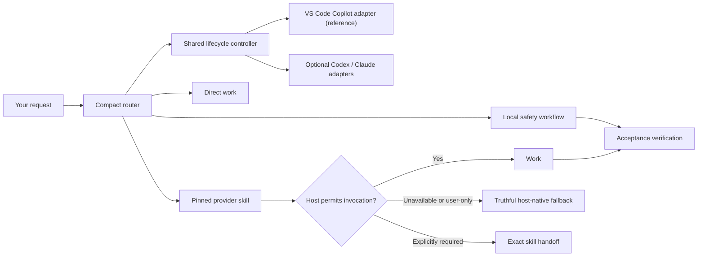

# Agentic Workflow

Agentic Workflow adds a compact project-level router and lifecycle guardrails to
GitHub Copilot in VS Code, OpenAI Codex, and compatible instruction-driven
hosts. You ask for work normally; it keeps simple requests direct and routes
larger work through curated, pinned skills.

## How it works



The router chooses the smallest useful workflow based on the request, risk, and
uncertainty. Provider skills keep their native methods and artifacts. A small
shared controller checks observable lifecycle invariants where host hooks run;
the instruction contract remains functional when hooks are unavailable.

For example:

> Implement ready ticket ARC-384, preserve API compatibility, and do not commit.

The router selects the implementation path, preserves the ticket identifier and
the no-commit boundary, and ends meaningful project changes with verification.
If a preferred provider cannot run, the host completes normally supported work
with its native capability and reports the fallback when material. An exact
`$skill-name` or `/skill-name` handoff is reserved for an explicitly required
provider or a real configuration boundary; the framework never claims the
provider ran when it did not.

## Supported hosts

| Host | Support |
|---|---|
| GitHub Copilot in VS Code | Primary/reference host. Router and project skills plus an active **Preview** hook adapter; user-only skills use `/skill-name`. Hooks may be disabled, so instruction fallback remains complete. |
| OpenAI Codex | Strong secondary host. Router and project skills; optional hook template; user-only skills use `$skill-name`. |
| Claude Code | Compatibility target. Root-policy classification and direct work; optional hook template; project skills are not projected into `.claude/skills`. |
| GitHub Copilot CLI/cloud agent | The versioned reference file is structurally discoverable, but runtime guarantees differ and are not release-validated; instruction fallback remains. |

## Prerequisites

Run every command in the environment that owns the target project: the macOS or
Linux host terminal, the VS Code terminal inside a Dev Container, or native
Windows PowerShell. The framework lifecycle requires:

- Python 3.11+
- HTTPS access to GitHub

Installing the optional curated provider set additionally requires GitHub CLI 2.97.0
or newer with `gh skill` and an authenticated GitHub.com CLI session.
If those provider prerequisites are unavailable, framework installation still
succeeds and host-native workflows remain usable.

Git is recommended for recovery but is not required. Use the official
[Python downloads](https://www.python.org/downloads/) and
[GitHub CLI installation guide](https://github.com/cli/cli#installation) if a
prerequisite is missing.

In the same terminal that owns the project, verify the prerequisites. These
checks are read-only:

```bash
# macOS, Linux, or a Dev Container
python3 --version
gh --version
gh skill install --help
gh auth status --hostname github.com
```

```powershell
# Native Windows PowerShell
py -3 --version
gh --version
gh skill install --help
gh auth status --hostname github.com
```

If the authentication check fails, this command opens GitHub's login flow and
persistently stores the resulting credential:

```bash
gh auth login --hostname github.com --web
```

## Install

Run the appropriate command from the ordinary project directory that should
become the project root. Installation is persistent: it adds the framework
policy, local integration skills, and ownership manifest shown below. It does
not create durable project state.

On macOS, Linux, or inside a Dev Container:

```bash
python3 -c "from urllib.request import urlopen; exec(compile(urlopen('https://raw.githubusercontent.com/jimmfan/agentic-workflow/main/skills/agentic-workflow/scripts/bootstrap.py', timeout=30).read(), 'agentic-workflow-bootstrap.py', 'exec'))"
```

On native Windows PowerShell:

```powershell
py -3 -c "from urllib.request import urlopen; exec(compile(urlopen('https://raw.githubusercontent.com/jimmfan/agentic-workflow/main/skills/agentic-workflow/scripts/bootstrap.py', timeout=30).read(), 'agentic-workflow-bootstrap.py', 'exec'))"
```

A successful installation ends with:

```text
OK: Agentic Workflow installed successfully.
OK: Framework integrity verified.
OK: Ready for normal agent work.
Project state: .ai-workflow-state/ (empty until needed)
```

Lifecycle status prefixes are portable ASCII. Dynamic text such as project paths
is preserved on UTF-8 terminals and escaped when a legacy console encoding cannot
represent it, so native Windows users do not need to change their code page.

Optional provider failures may add one neutral note but do not change framework
success or host-native readiness. Full optional configuration and static host
details are available through `status`, where a healthy project ends with
`No action required.`
Open a fresh Copilot chat or Codex task from the project root so the host
discovers the new policy and skills. VS Code hooks are Preview and require a
trusted workspace; lifecycle `status` reports host integration separately from
installation integrity and labels installed/static checks separately from live
host verification.

### What gets installed

```text
target-project/
├── AGENTS.md                  # managed router + project-owned section
├── CLAUDE.md                 # root-policy import + project-owned section
├── .agents/skills/           # framework-managed agent integration files
├── .github/hooks/
│   └── agentic-workflow.json # active VS Code Preview adapter
├── .ai-workflow/             # reconstructable framework installation
│   ├── install-manifest.json # framework ownership and checksums
│   ├── provider-state.json   # only when optional providers are installed
│   ├── providers.json        # tested capability mapping
│   ├── routing.md            # progressively loaded detailed router contract
│   ├── contracts/             # durable-state and project-profile contracts
│   ├── observability/        # optional, inert export analyzer
│   ├── runtime/              # shared controller, host matrix, opt-in adapters
│   └── templates/
└── .ai-workflow-state/       # empty canonical project-owned state directory after install
    ├── project-profile.md    # created only when useful context is persisted
    └── active.md             # created only when durable continuity is needed
```

`.ai-workflow/` is framework-owned and reconstructable. Lifecycle install and
update establish the empty `.ai-workflow-state/` directory as the canonical
project-owned durable-state location, but never seed a profile, active state, or
configuration file. Existing contents survive install, update, remove, and
reinstall byte-for-byte. Agent integration files are framework-owned files outside
`.ai-workflow/` because Copilot, Codex, Claude, or another agent environment
expects them at fixed paths. Per-turn controller state remains in the operating
system temporary directory, outside the repository.
`.ai-workflow-state/` is not added to `.gitignore`; projects may track it without
making Git a framework prerequisite.

A recognized pre-0.8 framework directory may still migrate from `ai-workflow/`
to `.ai-workflow/`. For compatibility with development-era installations only,
install and update import `.ai-workflow/project-profile.md` and the three legacy
paths `.ai-workflow/state/{active.md,records,archive}` into
`.ai-workflow-state/` when the canonical directory is absent or empty. These are
never current state locations. Moves preserve bytes and never scan for similarly
named files. A populated destination, symlink, or type conflict stops before
mutation rather than guessing or merging.

## Use it

Start a fresh task and describe the outcome normally. You do not need to learn
skill names or choose a workflow yourself.

Examples:

- `What does this retry code do?` stays direct.
- `Why did the API start returning 500s? Diagnose only.` uses the local
  diagnosis workflow without treating diagnosis as permission to fix.
- `Research whether Karpenter supports these scaling constraints.` selects
  research.
- `Implement ready ticket ARC-384 without committing.` selects implementation
  and verification while preserving the authorization boundary.

Some planning, specification, ticketing, implementation, and setup skills are
user-only in the supported hosts. Normal intent falls back to the host agent
when the provider was not explicitly invoked. Follow an exact `$skill-name` or
`/skill-name` handoff only when the user required that provider or the selected
operation genuinely depends on it.

Project-specific setup is not run during installation. If a selected workflow
needs tracker, domain, or triage-label configuration, the router first returns
`$setup-matt-pocock-skills` in Codex or `/setup-matt-pocock-skills` in Copilot.
Unrelated direct work does not require setup.

For debugging or observability, responses may include a compact effective-path
marker such as:

```text
[route: router → implement → verification]
```

## Lifecycle

Lifecycle commands run from the target project root unless an explicit target
path follows the action. The public bootstrap downloads and verifies the
appropriate framework revision automatically.

| Action | Effect |
|---|---|
| `install` | Install the framework transactionally; attempt optional pinned providers without making them a framework prerequisite |
| `update` | Update checksum-clean framework content; update providers only when provider state already exists |
| `status` | Read-only integrity and readiness check |
| `remove` | Remove only unchanged framework-owned content; preserve project-owned or modified content |

On macOS, Linux, or inside a Dev Container, replace `ACTION` with `update`,
`status`, or `remove`:

```bash
python3 -c "from urllib.request import urlopen; exec(compile(urlopen('https://raw.githubusercontent.com/jimmfan/agentic-workflow/main/skills/agentic-workflow/scripts/bootstrap.py', timeout=30).read(), 'agentic-workflow-bootstrap.py', 'exec'))" ACTION
```

On native Windows PowerShell:

```powershell
py -3 -c "from urllib.request import urlopen; exec(compile(urlopen('https://raw.githubusercontent.com/jimmfan/agentic-workflow/main/skills/agentic-workflow/scripts/bootstrap.py', timeout=30).read(), 'agentic-workflow-bootstrap.py', 'exec'))" ACTION
```

For example, this persistently updates a macOS, Linux, or Dev Container project:

```bash
python3 -c "from urllib.request import urlopen; exec(compile(urlopen('https://raw.githubusercontent.com/jimmfan/agentic-workflow/main/skills/agentic-workflow/scripts/bootstrap.py', timeout=30).read(), 'agentic-workflow-bootstrap.py', 'exec'))" update
```

The equivalent native Windows PowerShell update is:

```powershell
py -3 -c "from urllib.request import urlopen; exec(compile(urlopen('https://raw.githubusercontent.com/jimmfan/agentic-workflow/main/skills/agentic-workflow/scripts/bootstrap.py', timeout=30).read(), 'agentic-workflow-bootstrap.py', 'exec'))" update
```

To preview an install or update without changing the target, append `--dry-run`.
To reverse an installation, run the `remove` action; project-owned files and
modified or pre-existing skills intentionally remain.

## Safety guarantees

- Install and update verify the packaged payload before writes and use the
  installed ownership record plus current-byte checks to plan replacements.
- Same-named unknown, pre-existing, or locally modified skills block the
  operation instead of being replaced.
- Provider update may replace a directory only when local provider state records
  framework ownership and every recorded file checksum remains clean. Missing
  directories can be recreated; unknown or changed directories are preserved.
- Updates replace only checksum-clean framework content and never float pinned
  provider versions automatically.
- Framework and provider mutations each use staging, post-checks, and rollback
  within their own ownership boundary. An optional provider failure never rolls
  back a successful framework lifecycle operation.
- Durable project state under `.ai-workflow-state/` survives install, update,
  removal, and framework-directory reconstruction byte-for-byte.
- Install, update, and reinstall ensure `.ai-workflow-state/` exists, while
  leaving it empty until an authorized workflow has useful profile context or
  durable continuity to persist. Status is read-only, and removal preserves the
  directory and every project-owned entry.
- Deleting only `.ai-workflow/` and rerunning the coordinated installer is a
  supported recovery operation. Exact surviving framework and provider files
  reconstruct clean ownership metadata; conservatively reconstructed external
  files remain managed for updates but are preserved on later removal.
- Removal deletes a provider directory only when the framework recorded it as
  created and its current contents still match the locally recorded checksums.
- Removal does not prune unowned empty parent directories that existed before
  the lifecycle operation.

## Helpful details

- Runtime routing and inner integrity checks are local after installation. The
  documented public lifecycle command still needs HTTPS to fetch the recorded
  framework package.
- The first-stage public command fetches `main` over TLS; the bootstrap then
  resolves and verifies an immutable framework revision.
- The current framework release is `0.9.5` and its curated provider baseline is
  [`mattpocock/skills` v1.2.3](https://github.com/mattpocock/skills/releases/tag/v1.2.3).
- Ownership history is stored inside the target repository and is not
  tamper-evident. Coordinated local forgery can reclassify exact canonical
  framework or provider bytes. Without ownership-record tampering, modified,
  extra, undeclared, and unique project content remains outside automatic
  deletion. See the architecture document for the accepted boundary.

See [Architecture and ownership](docs/architecture.md),
[Workflow routing](docs/routing.md), [Verification](docs/verification.md), and
[Provider research](docs/provider-research.md) for the detailed contracts.

Agentic Workflow is available under the [MIT License](LICENSE).
