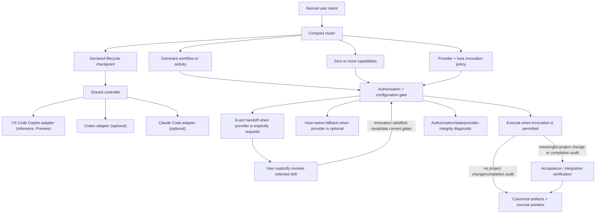

# Architecture and ownership

## Purpose

Agentic Workflow is an orchestration layer over curated upstream skills, not an
alternative skill library. The installed root policy classifies intent and
selects the minimum useful route. Mature provider skills own their detailed
methods and native artifacts. Local code owns only lifecycle safety,
project-specific authorization boundaries, durable orchestration pointers, and
acceptance/integration verification.

This division solves two problems: it avoids prompt and maintenance duplication,
and it keeps a stable project contract around methods that can evolve upstream.
The expected result is a compact always-on router whose invoked workflow bodies
load progressively from project-scoped `.agents/skills`; user-only selection
alone does not load them.

## Runtime path

GitHub Copilot in VS Code is the primary/reference host. The shared semantic
contract is host-neutral; adapters use only the deterministic surface each host
actually provides. VS Code hooks are Preview, so the instruction path remains a
complete fallback rather than a degraded afterthought.



Classification, invocation capability, execution, and authorization are
separate decisions. The router can prefer Wayfinder from ordinary intent even
when the active host cannot invoke it. In that case normal planning continues
with host-native capability and records neither provider execution nor durable
state unless continuity later requires it. An explicit provider request returns
the exact host syntax instead of silently substituting another provider.

The dominant workflow is the durable continuity owner when persistence is
needed. Research, Teach, Debugging, TDD, Verification, or Code Review may be a
standalone dominant activity or a capability composed inside another workflow.
Supporting use does not itself transition durable state. This is an
instruction-level composition contract, not a scheduler or workflow engine.
The complete selection rules remain in [Workflow routing](routing.md).

The root router contains capability names and composition constraints, not the
provider prompt bodies. `.ai-workflow/providers.json` maps capabilities to the
tested pin after routing selects an upstream capability. Each skill directory
then participates in normal host progressive discovery.

`implement` owns its TDD and fixed-point Code Review subflows. The local
implementation adapter delegates once when provider execution is available and
otherwise permits host-native implementation. The local verifier reuses actual
provider evidence when present. The router does not invoke TDD or Code Review a
second time merely because they are available.

## Deterministic lifecycle boundary

The active VS Code adapter installs at the unique workspace path
`.github/hooks/agentic-workflow.json` and calls the shared standard-library
Python controller for SessionStart, UserPromptSubmit, PreToolUse, PostToolUse,
and Stop. The controller checks declared route/authority state, provider
outcomes, native repository-write authorization, digest-bound durable-state
transitions, and completion evidence. Opaque operations require a one-use model
classification; the controller does not parse arbitrary shell semantics.

VS Code exposes no documented structured channel for a model to send its own
semantic route directly to a lifecycle hook, and `UserPromptSubmit` cannot inject
model context. The reference adapter therefore keeps the compact controller CLI
as the declaration transport. Session/root context supplies the protocol before
tool use, and `PreToolUse` auto-approves only a strictly parsed framework
declaration after applying it to transient state. All requested terminal and
other host actions remain separate tool calls under ordinary host policy.

Codex and Claude Code adapters are shipped as opt-in examples under
`.ai-workflow/runtime/adapters/` because their fixed project settings may
already be user-owned and their trust/runtime contracts differ. Copilot CLI and
cloud agent can parse the versioned VS Code-compatible file but have different
execution surfaces; their enforcement is not inferred from VS Code. The complete host research, hard-rule
ownership audit, privacy boundary, fallback behavior, and known gaps are in
[Lifecycle enforcement and hard-rule audit](enforcement.md). ADR 0009 records
the decision.

Per-session controller state is metadata-only and lives under the operating
system temporary directory. It is not repository truth, contains no prompt or
tool content, and is deleted after a successful completion gate. Canonical
durable Agentic Workflow state remains in `.ai-workflow-state/` or
provider-native artifacts.

## Filesystem ownership boundary

The physical layout follows ownership rather than file purpose:

```text
FRAMEWORK OWNED AND RECONSTRUCTABLE
├── .ai-workflow/
├── managed AGENTS.md and CLAUDE.md content
└── agent integration files at host-required paths

PROJECT OWNED AND DURABLE
└── .ai-workflow-state/
    ├── project-profile.md
    ├── active.md              # only when durable continuity exists
    ├── records/
    └── archive/

TRANSIENT AND MACHINE LOCAL
└── operating-system temporary directory
```

`.ai-workflow/` contains only package/configuration-derived runtime, routing,
contracts, templates, provider declarations, and lifecycle ownership metadata.
It is disposable: deleting it and reinstalling reconstructs the installation
without touching `.ai-workflow-state/`. Framework-owned agent integration files
remain outside that directory only because supported agent environments require
fixed discovery paths such as `.github/hooks/` and `.agents/skills/`.

The current install manifest records framework files only. It does not checksum
or enumerate mutable project state. Install and update ensure the canonical
`.ai-workflow-state/` directory exists, but the directory and everything inside
it remain project-owned. An authorized workflow creates `project-profile.md`
only after it has useful verified durable context to record, and creates
`active.md` from the framework template only when continuity is actually
required.

After deletion of `.ai-workflow/`, reinstall recognizes a structurally valid
managed policy and compatible surviving framework/provider files. Because the deleted metadata cannot
prove whether an external exact file originally predated adoption,
reconstructed files remain updateable but are conservatively preserved on
removal. This is the one intentional recovery exception to ordinary created-file
removal.

The only current project-state location is `.ai-workflow-state/`. As a bounded
compatibility import for development-era installations, lifecycle code still
recognizes `.ai-workflow/project-profile.md` plus the legacy
`.ai-workflow/state/{active.md,records,archive}` paths and moves them into
`.ai-workflow-state/` only when the canonical directory is absent or empty.
Those source paths are never current destinations. The move preserves bytes and
uses no repository search. A populated destination, unsafe path, or type
conflict fails before mutation; removal preserves any old paths that have not
been migrated.

The installed root policy is intentionally only an orchestration kernel and
hooks-off semantic fallback. Detailed classification, invocation, composition,
and route-output rules live in `.ai-workflow/routing.md` and load only for a
named skill, resume, uncertain route, or route that is not confidently direct.
Selected skills, provider metadata, runtime, state, and profile contracts then
load only when that route needs them.

## Provider selection

The curated source is `mattpocock/skills` tag `v1.2.3`. The declaration records
the reviewed repository/tag, upstream path, invocation policy, and configuration
requirements for every selected skill. Routed capabilities are Wayfinder,
Teach, Research, to-spec, to-tickets,
implement, TDD, and Code Review. Setup is an explicit configuration operation.
Grilling, domain-modeling, prototype, and codebase-design are composition
dependencies. `triage` is an installed configuration dependency: its presence
causes setup to provision the triage-label vocabulary required by to-spec and
to-tickets, but it is not promoted to a normal root route.

The provider declaration records two orthogonal mappings: capabilities select
skills, while every skill separately declares configuration prerequisites and
per-host invocation behavior. Installation validates required invocation
metadata in the installed skill without maintaining a parallel complete
upstream inventory.
Codex and GitHub Copilot are supported through `.agents/skills`; Claude Code's
native project-skill location is `.claude/skills`. The root `CLAUDE.md` policy
remains useful for classification and host-native work, but neither local nor
provider skill bodies are projected there. Provider execution remains
unavailable rather than being falsely claimed.

The local framework deliberately retains:

- bounded Discovery, which is smaller than Wayfinder and preserves local
  decision-state semantics;
- Debugging, because its diagnosis-only authorization boundary, non-test signal
  handling, and durable interruption model are not equivalent to upstream
  `diagnosing-bugs`;
- an Implementation adapter, which connects native tickets/specifications to
  local authorization and acceptance verification without copying method text;
- Verification, which validates project acceptance and integration boundaries
  rather than repeating provider TDD or Code Review.

The framework retires its former Teach, Decomposition, and Review copies plus
the obsolete learning/ticket templates. Update removes those only when their
recorded bytes are unchanged; local changes are reclassified as project-owned.

## Setup and learning lifecycle

`setup-matt-pocock-skills` is installed as a dependency but is not run during
installation or on every prompt. It is prompt-driven and user-only on Codex and
GitHub Copilot at the pinned release; it is unavailable on Claude Code. Setup
creates project-owned tracker, domain, and triage-label configuration. Only
after selecting a configuration-dependent workflow does the router check that
skill's declared prerequisites. If one is absent, the router selects setup and
returns `$setup-matt-pocock-skills` for Codex or
`/setup-matt-pocock-skills` for Copilot. It does not claim setup ran or write an
artifact. Unrelated direct work remains immediately available.

Lifecycle output leads with installation integrity and normal-work readiness.
Install is quiet after success; `status` places optional provider, profile,
configuration, and static host details secondarily and explicitly says when no
action is required. A missing optional profile, no active workflow, or absent
setup configuration does not make normal status fail. Malformed or unsafe
existing durable state remains visible. The profile
is an optional project-owned advisory cache, not a versioned structured
artifact: any other readable non-empty UTF-8 regular file is `present`,
regardless of headings. Lifecycle operations never seed or rewrite it, although
they may move its bytes from the one known development-era path when the
canonical state directory is empty.
Existing active state remains structurally validated
because it controls resume and transition behavior. Profile creation and later
maintenance require verified durable evidence and write authorization, and do
not trigger an automatic full-repository scan.

Teach is selected only for explicit sustained learning intent. Its mission,
glossary, resources, lessons, and learning records belong in a dedicated
learning workspace. Ordinary knowledge questions remain direct and do not seed
course artifacts into an engineering repository.

## Distribution boundary

The source package is inert. Its resources do not mirror active repository
customization paths:

```text
payload/root/AGENTS.md.template  -> AGENTS.md
payload/root/CLAUDE.md.template  -> CLAUDE.md
payload/skills/*/SKILL.md        -> .agents/skills/*/SKILL.md
payload/ai-workflow/routing.md   -> .ai-workflow/routing.md
payload/ai-workflow/...          -> .ai-workflow/...
payload/hosts/vscode-agentic-workflow.json -> .github/hooks/agentic-workflow.json
gh skill exact upstream paths    -> .agents/skills/<upstream-name>/...
```

The framework keeps profile and active-state templates under
`.ai-workflow/templates/`; authorized workflows may use them when useful durable
state is first required, but lifecycle operations never materialize those
templates as project state files.

`bootstrap.py` resolves and downloads an immutable framework revision and runs
the package verifier. `lifecycle.py` coordinates preflight and mutation.
`adopt.py` owns the local payload transaction. `providers.py` owns the curated
provider transaction through GitHub CLI. Installed repositories do not need the
source checkout or bootstrap package at runtime.

Every packaged Python entry point uses ASCII terminal presentation and configures
standard output and standard error to backslash-escape only text that the active
console encoding cannot represent. This keeps default Windows code pages safe
without changing lifecycle results or requiring a terminal encoding change.

The schema-5 distribution manifest authenticates the current payload mappings,
checksums, and retired framework paths. It does not carry a catalog of historical
release identities. A cross-version update validates the installed ownership
record structurally and compares current bytes with locally recorded checksums
before replacement or retirement. The target-local schema-3
`install-manifest.json` records framework files only; older schemas remain
readable where inexpensive, and their `project_owned` inventories are not
carried into new manifests.

## Optional observability boundary

The installed `.ai-workflow/observability/analyze.py` is a leaf utility, not a
runtime component. No root policy, local skill, provider skill, lifecycle
script, state template, or verification route imports or invokes it. It reads
only user-named telemetry exports, emits only to standard output, and uses no
database or third-party dependency. This preserves portable instruction-driven
routing even when VS Code, Copilot, OpenTelemetry, and SQLite are absent.

Native Agent Debug remains the per-session diagnostic UI, and an existing OTLP
collector/backend remains the production storage/dashboard path. The optional
normalizer adds only framework-aware, privacy-reduced cross-run summaries. Its
Preview format adapters and lifecycle decision are documented in
[Optional observability](observability.md).

## Provider lifecycle and pinning

GitHub CLI 2.97.0 or newer is the optional provider installer. `providers.py`
calls `gh skill install` with the reviewed upstream directory, `--pin v1.2.3`,
project scope, and the Codex target (which resolves to the common
`.agents/skills` location). It validates:

- skill directory name and frontmatter name;
- required repository, path, and tag/ref metadata; and
- declared host invocation semantics from the installed metadata files.

The framework does not call ordinary `gh skill update` during normal lifecycle
work because pinned skills are intentionally skipped. A provider upgrade is a
framework release change: maintainers review a new stable tag, run live and
hermetic compatibility checks, then release. A target receives that baseline
only through an explicit framework update.

Initial adoption rejects every same-named pre-existing provider directory as
unowned before contacting GitHub. It stages the pin, validates required metadata
and invocation semantics, then records hashes of the bytes that the installer
actually produced. Once that ownership
and baseline are recorded, inner status checks compare the current directory to
those recorded hashes and do not contact the provider upstream; the public
bootstrap still needs HTTPS to fetch the recorded framework package.

Across a declaration change, update uses the target-local provider state as its
ownership and cleanliness baseline. Every current file must still match the
hashes recorded when that directory was installed. Update plans all conflicts
before staging or mutation.

A retained directory already compatible with the new declaration keeps its old
origin. A missing recorded directory is installed normally. An incompatible
directory may be replaced only when its local record says `created` or
`reconstructed` and all checksum checks are clean; locally modified and
pre-existing-compatible directories are preserved. New same-named unknown
content blocks replacement. New bytes are staged and validated before any
authorized replacement, so this migration does not float versions. A missing managed directory is recreated normally,
including when the provider declaration itself is unchanged.

Remove considers only provider-state records. It deletes a directory only when
its current file set and checksums still match the record and its origin is
`created`; incompatible, modified, extra-file, `preexisting-compatible`, and
`reconstructed` directories are preserved. Origin and installed-hash history is
repository-local evidence, not tamper-evident.

## Coordinated transaction boundary

A normal install preflights and commits the framework payload, establishes the
empty canonical project-state directory, then attempts the optional provider
installation. Provider staging rolls back its own partial writes on failure,
while the valid framework remains installed and usable. Lifecycle operations
never seed durable profile or active state. Project-created or modified content
is preserved.

Within the payload transaction, install and update run their integrity
post-check before commit. A post-check or atomic-write failure restores all
replaced/deleted bytes and modes and removes only parent directories created by
that transaction. Successful removal deletes owned files but does not prune
untracked empty parents, because the framework has no durable proof that it
created those directories.

Update commits the framework transaction first. When provider state exists, it
then attempts a separate provider transaction whose staging, post-check, and
rollback protect the existing provider directories and state. A provider failure
does not roll back the verified framework update; it reports degraded optional
capability and leaves host-native fallback available.

The consuming-project state root is `.ai-workflow/`. A one-time update migration
recognizes the former `ai-workflow/` layout only through a valid managed
installation manifest, renames the directory, translates
its historical path identities, and continues the normal coordinated update.
If update fails before commit, the original directory name is restored. The
lifecycle never merges `ai-workflow/` with `.ai-workflow/`, and it never claims
an unrelated same-named directory.

Update verifies and applies the payload before attempting a changed provider
baseline. Provider update preserves conflicting directories and adds only safe
missing ones. Removal preflights the payload, safely processes bounded provider
ownership, then removes the payload even if optional provider cleanup cannot
proceed. A machine crash or failing storage remains a reason to use
version-control or filesystem backup recovery; the framework does not claim
cross-process crash atomicity.

## Ownership

- Framework-owned payload content is updated only when its currently installed
  managed bytes match recorded checksums.
- Durable project state is never created by lifecycle operations and is never
  included in framework ownership metadata.
- Root `AGENTS.md` and `CLAUDE.md` are composite, including fresh framework
  creation; the framework owns marked blocks and byte-preserves project
  sections. For an exact pre-existing policy, schema-2 and newer installation state also
  retains checksum-validated restoration bytes so later managed-source updates
  cannot erase the removal baseline. Update migrates schema-1 exact-policy and
  previous clean fully-owned `CLAUDE.md` records into this model before normal
  setup/project edits.
- Payload origin and restoration fields, like provider origin, are
  repository-local history and not tamper-evident proof. The architecture
  deliberately accepts that editing those records can reclassify ownership.
  Without record forgery, current-byte checks keep modified managed bytes, extra
  provider content, undeclared paths, and unique project content outside
  automatic replacement or deletion.
- Same-named incompatible local or provider skills block installation before
  writes.
- Provider-native maps, tickets, specifications, learning records, and review
  output remain canonical. Framework records store only pointers and exact
  return targets.
- Provider instructions do not grant authorization to commit, publish, mutate
  trackers, or write setup/course artifacts.

## State precedence and identity

Live/source evidence is authoritative for current behavior. Accepted ADRs and
domain documentation are canonical for project decisions; native provider
artifacts are canonical for provider-owned outputs; the optional project-owned
profile is only non-authoritative advisory context: a concise verified cache and
pointer layer. All outrank private memory and chat recollection. Wayfinder's
configured tracker owns map and decision-ticket
identities, labels, linked titles, and map vocabulary. to-tickets similarly owns
its ticket identity and frontier. The framework never allocates a parallel
`DEC`, `TKT`, `UNK`, or learning alias for those artifacts.

`.ai-workflow-state/active.md` represents one durable active framework workflow per
repository. Capabilities may compose inside it without taking over the pointer.
A conflicting second durable workflow must be resolved explicitly—complete,
interrupt, or supersede the first—rather than overwritten. Ephemeral direct and
read-only work can proceed when it does not interfere, so this remains a small
file contract rather than a lock service or concurrency runtime.

Local identifiers remain only for distinct local concepts: `DEC` for bounded
Discovery decisions, `IMP` for durable implementation orchestration, `DBG` for
debugging, and optional `IDP` opportunities.
