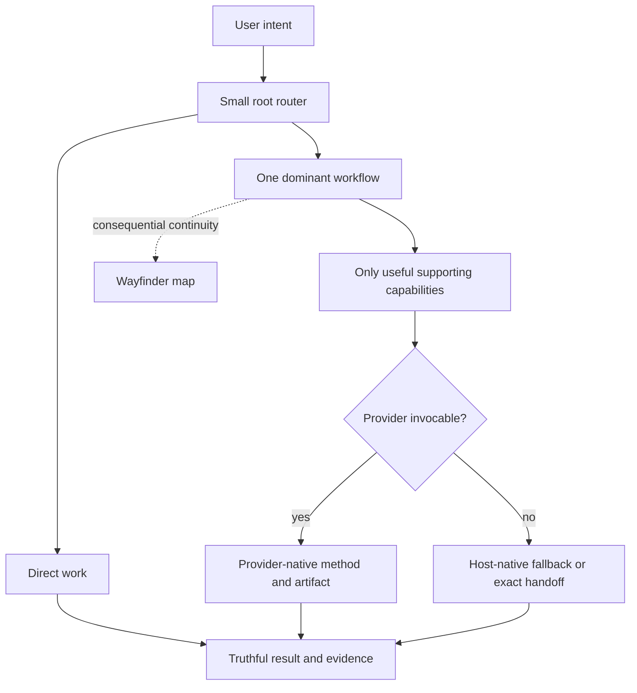

# Architecture and ownership

## Purpose

Agent Workflow is a thin instruction router over host capability and curated,
replaceable skills. Its core job is reliable minimum-workflow selection while
preserving authorization and project-owned data. It is not a general agent
runtime, package manager, hook framework, analytics system, or second
representation of provider artifacts.

The architecture optimizes for two pre-1.0 priorities:

1. do not destroy project-owned or user-owned data; and
2. make core routing behavior reliable.

## System topology



The root `AGENTS.md`, selected skills, and progressively loaded
`.agent-workflow/routing.md` form the instruction runtime. There is no lifecycle
controller, background daemon, telemetry service, or host hook enforcing the
route.

Routing begins Direct and classifies from user intent plus cheap installed-skill
descriptions. Detailed routing loads only when ownership, composition, provider
fallback, handoff, or durable resumption is materially unclear. Routing may change
as evidence emerges. Selection, provider invocation, authorization, execution,
and completion evidence remain distinct; host sandboxing and approvals remain
authoritative.

Wayfinder is the framework's sole durable coordination model. It keeps only
consequential continuity and pointers, while specialists retain their methods
and native artifacts. Specifications, tickets, research, reviews, learning
workspaces, and other provider outputs remain canonical in their native
locations.

## Filesystem ownership

```text
FRAMEWORK-OWNED, RECONSTRUCTABLE
├── .agent-workflow/
├── managed AGENTS.md and CLAUDE.md regions
├── required mapped integration files
└── declared provider names under .agents/skills/

PROJECT-OWNED, DURABLE
└── .agent-wayfinder/
    └── <effort>/               # map-first Wayfinder coordination
        ├── map.md
        ├── facts.md            # optional current F# ledger
        ├── decisions.md        # optional current D# ledger
        ├── unknowns/           # optional independent U# files
        └── evidence/           # optional substantial E# files

OPTIONAL, INDEPENDENT
└── unrelated local skill directories under .agents/skills/
```

### Reconstructable framework output

`.agent-workflow/` is derived from the current package and may be replaced as a
unit. Missing, modified, obsolete, or extra files inside it do not require
historical checksum investigation. The current distribution manifest provides
an explicit source-to-target map rather than a historical ownership database.

The supported bootstrap and adoption path stores distributable root policies
under non-active template names. A maintainer check rejects literal root-policy
files and top-level host-customization trees inside the payload. Adoption
activates framework resources by projecting their explicit mappings into the
repository locations recognized by supported hosts.

`AGENTS.md` and `CLAUDE.md` are composite files. Lifecycle operations replace
only their unambiguous managed region and preserve project-region bytes. Other
required external paths use minimal recorded evidence so unknown or subsequently
modified content is preserved rather than overwritten or deleted.

### Project-owned durable state

`.agent-wayfinder/` and every entry below it are project-owned. Install and
update may establish the root when absent, but lifecycle operations never seed,
inventory, validate, checksum, merge, migrate, rewrite, or remove its contents.

Wayfinder efforts currently live directly at `.agent-wayfinder/<effort>/`.
Their `map.md` is the brief coordination summary and the first effort file read
when resuming. It owns the effort's ready work.
Optional `facts.md` and `decisions.md` ledgers hold current F# and D# sections;
independently useful U# questions and substantial E# evidence remain separate
files. The map indexes relevant detail rather than duplicating those stores.
After map orientation, only the relevant ledger section or U#/E# file loads. If
most supporting artifacts are needed merely to recover the current route, the
effort is over-decomposed and needs reconciliation. This
intermediate-granularity default reduces unnecessary retrieval decisions
without treating one topology as universally superior.

Every current fact carries traceable source, authority, or derivation provenance
and enough scope to avoid unsupported generalization. A D#'s presence means it
is the current committed choice under actual project authority; evidence may
support a choice but does not create that authority. The map represents current coordination state and
should converge as lasting outcomes move to canonical artifacts. Exact allocation,
reconciliation, pruning, effort-ending, and reference behavior is owned by the
progressively loaded Wayfinder state contract and its tests.

This source repository's project instructions declare
`architecture-decisions/`. Elsewhere, a consuming project's declared convention
or the selected provider's native convention owns the location; Agent Workflow
imposes no additional ADR path. Wayfinder decisions may link an ADR but do not
become a parallel source of project policy.

## Provider boundary

`.agent-workflow/providers.json` declares the reviewed upstream provider
identity, bundled snapshot, license, supported-host invocation policy, adapters,
and configuration requirements. The release projects only that finite declared
set. Declared names are reconstructable and repairable; unrelated local skill
directories are preserved.

Provider reconciliation stages and validates the complete declared projection
before replacing it. Provider failure does not invalidate a successful core
lifecycle operation. Exact snapshot hashes, adapter preconditions, staging,
comparison, and cleanup behavior are implementation and test details.

Wayfinder is a deliberate derived-runtime exception. The raw pinned snapshot
and its provider-owned vocabulary remain unchanged as reviewed provenance, while
the effective installed body uses one coherent map-first operational model rather
than layering local state rules over conflicting upstream tracker mechanics. It
uses objective, scope, areas and relationships, literal uncertainty or blocker
language, ready work, readable names, and progressive resolution.

Provider instructions never authorize commits, publication, tracker mutation,
or broader external access. An unavailable or non-invocable provider normally
falls back to truthful host-native work unless the user specifically requires
that provider or a real safety boundary prevents fallback.

## Lifecycle and bootstrap boundary

The public bootstrap resolves an immutable source revision and validates archive
shape and resource bounds before executing package code. `adopt.py` preflights
project-data, composite, external-path, and filesystem conflicts before applying
current desired state. `lifecycle.py` runs core reconciliation before the
independent optional-provider operation.

`status` is read-only. `remove` deletes only safely owned reconstructable output,
strips managed composite regions, and preserves `.agent-wayfinder/` plus unknown
or modified external content. Transactions protect current data but do not claim
database-style crash semantics.

Current execution uses Python 3.11+ standard-library APIs on POSIX-style shells
for macOS, Linux, WSL, and Linux-based devcontainers. Native PowerShell and CMD
are not supported. These runtime and transport facts are current compatibility
documentation rather than architecture decisions.

The package is distributed through the repository-owned Python bootstrap rather
than `gh skill`. GitHub CLI 2.97.0 rewrites every nested `SKILL.md` during a
recursive skill install, which changes bundled provider bytes and assigns the
outer package's provenance to inner skills; the current installer behavior is
visible in GitHub CLI's versioned
[`installSkill` implementation](https://github.com/cli/cli/blob/v2.97.0/internal/skills/installer/installer.go#L232-L285).
Changing transports therefore requires demonstrated byte preservation for the
complete package, not merely successful installation of the outer skill.

## Verification boundary

`verify_package.py` is a maintainer, CI, and release gate; bootstrap does not run
it for consumers. It checks package structure and activation-sensitive payload
paths, explicit mappings, routing and provider contracts, deterministic
scenarios, local documentation links, and the test suite.

Tests focus on observable boundaries:

- route selection, invocation truthfulness, and authorization;
- preservation of project-owned state and ambiguous external content;
- install, update, status, remove, and bootstrap behavior;
- coherent Wayfinder state and provider projection; and
- isolation of optional-provider failure from core lifecycle success.

Live-model evaluations remain opt-in evidence rather than deterministic release
requirements.

## State precedence

Live source and observed behavior are authoritative for current system facts.
Accepted ADRs and project documentation own project decisions. Provider-native
artifacts own provider output. `.agent-wayfinder/` owns local workflow
continuity. These sources outrank summaries, private agent memory, and chat
recollection.

Current architectural rationale is intentionally limited to:

- [ADR-0010 — Framework output and project-owned state](../architecture-decisions/0010-separate-framework-output-from-project-owned-state.md)
- [ADR-0011 — Map-first Wayfinder state](../architecture-decisions/0011-use-map-first-wayfinder-state.md)
- [ADR-0025 — Authority at consequential boundaries](../architecture-decisions/0025-preserve-authority-at-consequential-boundaries.md)
- [ADR-0027 — Direct-first progressive routing](../architecture-decisions/0027-use-direct-first-progressive-routing.md)
- [ADR-0028 — Wayfinder as sole durable coordinator](../architecture-decisions/0028-use-wayfinder-as-sole-durable-coordinator.md)

See also [Workflow routing](routing.md) and [Verification](verification.md) for
current operational detail.
