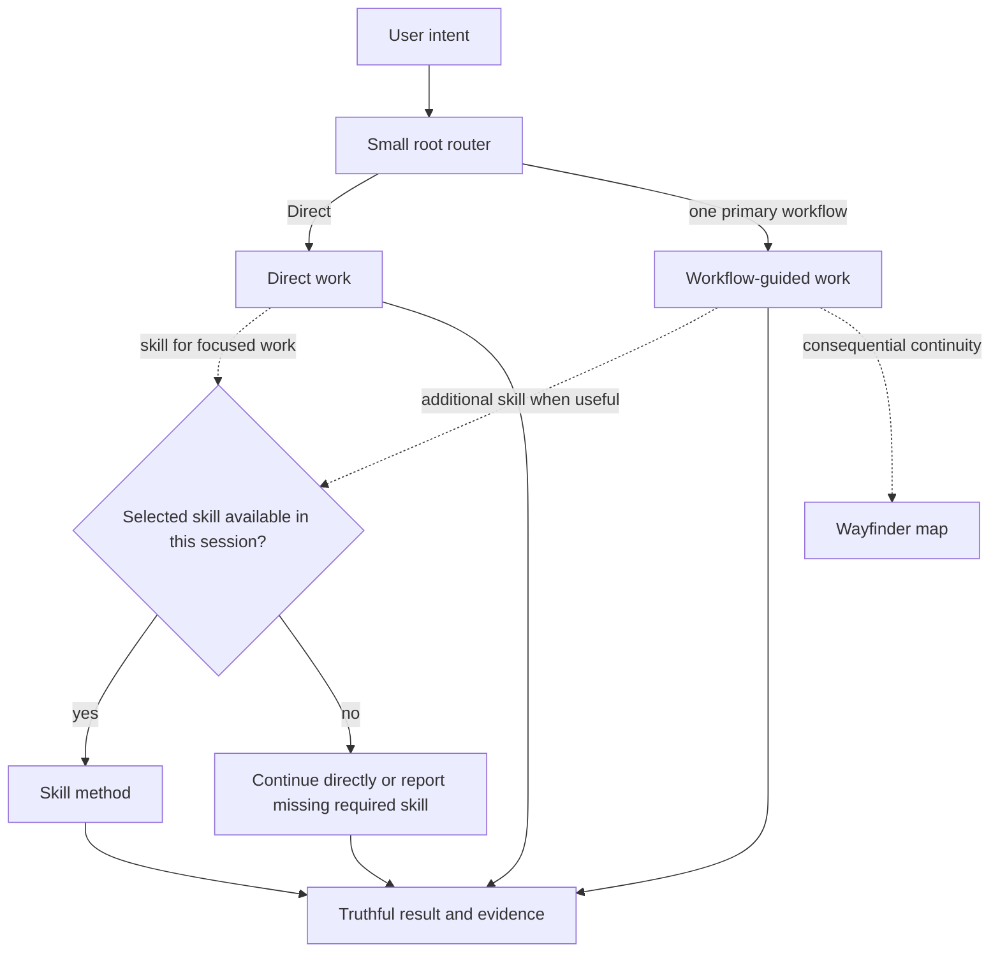

# Architecture and ownership

## Purpose

Agent Workflow is a thin instruction router over host capability and curated,
replaceable skills. Its core job is reliable minimum-workflow selection while
preserving action authorization, project decision authority, and project-owned
data. It is not a general agent runtime, package manager, hook framework,
analytics system, or second representation of accepted project results.

The architecture optimizes for two pre-1.0 priorities:

1. do not destroy project-owned or user-owned data; and
2. make core routing behavior reliable.

## System topology



The root `AGENTS.md`, selected skills, and progressively loaded
`.agent-workflow/routing.md` form the instruction runtime. There is no lifecycle
controller, background daemon, telemetry service, or host hook enforcing the
route.

Routing begins Direct and classifies from user intent plus skill descriptions
exposed in the current session. Detailed routing loads only when workflow
composition or artifact or record responsibility is unclear or selected-skill
availability, an exact invocation instruction, agent handoff, or durable
resumption materially matters. Routing may change as evidence emerges. Route
selection, skill selection, material execution, and completion or verification
evidence remain distinct. See [Workflow routing](routing.md) for how the agent
uses skills during Direct work or with a primary workflow. Host sandboxing and
approvals determine host permission; that permission does not itself authorize
an action or commit a project choice.

Project-choice commitment and action authorization are separate gates. Required
evidence must be sufficient before accepted project policy determines a choice or
the person, role, or valid delegate with project decision authority commits it.
Writes and external mutations proceed only when the current user request or
accepted project policy authorizes that action and scope.

Wayfinder is Agent Workflow's sole durable coordination model. It stores only
consequential coordination state and references. Specifications, tickets,
research, reviews, and other results remain in the artifacts or records
designated to maintain them.

## Filesystem ownership

```text
FRAMEWORK-OWNED, RECONSTRUCTABLE
├── .agent-workflow/           # routing, contracts, schemas, and tools
├── managed AGENTS.md and CLAUDE.md regions
└── current curated .agents/skills/<name>/ directories

PROJECT-OWNED, DURABLE
└── .agent-wayfinder/
    └── <effort>/               # map-first Wayfinder coordination
        ├── map.md
        ├── facts.md            # optional current F# ledger
        ├── decisions.md        # optional current D# ledger
        ├── unknowns/           # optional independent U# files
        └── evidence/           # optional substantial E# files

OPTIONAL, INDEPENDENT
└── unrelated local skill directories under .agents/skills/
```

### Reconstructable framework output

`.agent-workflow/` is derived from the current package and may be replaced as a
unit. Missing, modified, obsolete, or extra files inside it do not require
historical checksum investigation. The current distribution manifest provides
an explicit source-to-target map rather than a historical ownership database.

The supported bootstrap and adoption path stores distributable root policies
under non-active template names. A maintainer check rejects literal root-policy
files and top-level host-customization trees inside the payload. Adoption
activates framework resources by projecting their explicit mappings into the
repository locations recognized by supported hosts.

`AGENTS.md` is a composite file. Lifecycle operations replace only one
unambiguous managed region and preserve every project-owned byte before and
after it. Repeated convergence leaves exactly one two-delimiter managed region;
ambiguous marker states stop before mutation. The existing `CLAUDE.md`
integration remains unchanged pending a host-compatible replacement with no
support regression.

### Project-owned durable state

`.agent-wayfinder/` and every entry below it are project-owned. Wayfinder creates
and uses that tree only when durable coordination is needed. Lifecycle operations
do not directly traverse, interpret, or change it.

Wayfinder efforts currently live directly at `.agent-wayfinder/<effort>/`.
Their `map.md` is the brief coordination summary and the first effort file read
when resuming. It summarizes the effort's current coordination state, conditions
blocking particular work, dependencies, and ready work. When no durable ticket
or ticket set exists, the map may state ready work directly. Once `to-tickets`
creates a durable ticket or ticket set, that ticket or ticket set maintains its
contents, dependencies, ordering, and readiness. The map links that durable
ticket or ticket set and may include the current ready-work reference without
mirroring ticket-level state. A ticket draft returned only in chat remains
session-local and is not a durable reference target.
The literal framework schema under `.agent-workflow/schemas/wayfinder/` owns the
exact structure of newly initialized maps, and the installed standard-library
helper under `.agent-workflow/tools/` creates only that map shell. Required
objective, scope, and current-state placeholders must be replaced meaningfully
before the map is treated as populated durable state. Existing maps remain
recognized by their safe path and regular `map.md`, without migration,
exact-heading validation, or formatting-only rewrites.
Optional `facts.md` and `decisions.md` ledgers hold current F# fact records and
D# decision records. F# contains a current scoped descriptive conclusion judged
sufficiently supported and remains revisable; D# contains a current choice
determined directly by accepted project policy or committed by the person, role,
or valid delegate with project decision authority. Independently useful U# unresolved
question records and E# evidence records with source, scope, observation, and
limitations remain separate files. The map indexes relevant detail rather than
duplicating those stores.
After map orientation, only the relevant ledger section or U#/E# file loads. If
most supporting records are needed merely to recover the current route, the
effort is over-decomposed and needs reconciliation. This
intermediate-granularity default reduces unnecessary retrieval decisions
without treating one topology as universally superior.

Every current fact record identifies the source that establishes its conclusion
for the stated scope or the evidence or record from which it was derived, plus
material limitations. A D#'s presence means its choice is current and binding
under the project-choice gate; evidence may inform a recommendation or choice but
cannot commit it alone. The map represents current coordination state
and should converge as lasting outcomes move to the artifacts designated to
maintain them. The progressively loaded Wayfinder state contract and its tests
define exact allocation, reconciliation, pruning, effort-ending, and reference
behavior.

This source repository's project instructions designate
`architecture-decisions/`. Elsewhere, a consuming project's declared convention
or the selected skill's artifact convention designates the location;
Agent Workflow imposes no additional ADR path. Wayfinder decision records may link an
ADR but do not become a second ADR or other project-policy record.

## Curated skill boundary

The ordinary distribution manifest maps the complete fifteen-skill curated
payload directly into `.agents/skills/`. Each current curated skill name is a
reserved, reconstructable directory that install and update replace completely;
unrelated local skill directories are preserved. Supported hosts discover
project skills from that location and expose them to the agent.

Install and update treat every current curated name as a reserved framework
surface and replace the complete directory without recognition, interaction, or
collision state. The conservative recognition check applies only to remove on an
otherwise unrecognized target. Ambiguous composite markers remain a hard
preflight failure for every mutating lifecycle operation.

Eleven curated skills are maintained derived works of Matt Pocock's `v1.2.3`
release. Their effective installed versions are the maintained runtime source;
complete repository, copyright, and MIT license attribution lives in
`.agent-workflow/README.md`.

Wayfinder's effective installed body uses one coherent map-first operational
model rather than layering local state rules over conflicting upstream tracker
mechanics. It uses objective, scope, areas and relationships,
unresolved-question or blocker language, ready work, readable names, and
progressive resolution.

Skill instructions do not authorize commits, publication, tracker mutation,
broader external access, or project choices. If a selected skill is unavailable
or cannot run without explicit user invocation, continue directly only when the
skill was optional and an authorized equivalent can satisfy the request;
otherwise report the unmet requirement or give the exact invocation instruction.

## Lifecycle and bootstrap boundary

The public bootstrap resolves an immutable source revision and validates archive
shape and resource bounds before executing package code. `lifecycle.py` owns the
single install, update, status, and remove implementation. The ordinary
distribution manifest is only its current source-to-target map.

Install and update converge to current desired state by replacing the complete
`.agent-workflow/` directory and every current curated skill directory, and by
updating the managed regions in `AGENTS.md` and `CLAUDE.md`. Remove deletes those
managed directories and regions while preserving unrelated skill directories
and project-authored composite bytes. Lifecycle does not directly traverse,
interpret, or change `.agent-wayfinder/`. On an unrecognized target, remove
refuses current curated-name directory collisions before mutation because their
ownership is not established.

Lifecycle is desired-state filesystem convergence over explicitly owned
surfaces. An explicit existing non-root directory is used directly. When the CLI
target is omitted, Git may discover the containing worktree root; Git absence,
`HEAD`, tracked changes, untracked files, ignore rules, and repository-wide state
are not lifecycle prerequisites or recovery contracts. Preflight is limited to
composite ownership and managed roots and parents, rejecting malformed markers,
symlink or unsupported root/parent entries, and path escapes. Nested entries in
a replaceable managed directory are ordinary convergence input. `status` reports
only managed drift or conflicts. There is no installed manifest, provenance
database, migration engine, retirement history, cross-surface transaction,
backup, or rollback mechanism. Obsolete files inside `.agent-workflow/`
disappear through complete desired-state replacement. Skill directories outside
the current curated inventory remain untouched; historical skill names do not
participate in runtime policy.

Current execution uses Python 3.11+ standard-library APIs on POSIX-style shells
for macOS, Linux, WSL, and Linux-based devcontainers. Native PowerShell and CMD
are not supported. These runtime and transport facts are current compatibility
documentation rather than architecture decisions.

The package is distributed through the repository-owned Python bootstrap rather
than a recursive skill installer, because the distribution contains root policy,
routing contracts, and fifteen independently discoverable project skills.

## Verification boundary

`verify_package.py` is a maintainer, CI, and release gate; bootstrap does not run
it for consumers. It checks current package structure and activation-sensitive
payload paths, explicit mappings, routing and skill contracts, attribution,
deterministic scenarios, local documentation links, and the test suite.

Tests focus on observable boundaries:

- route selection, truthful reporting of skill execution, material
  execution evidence, project-choice commitment, and action authorization;
- rejection of unsafe managed destinations before mutation;
- install, update, status, remove, and bootstrap behavior;
- coherent Wayfinder state and the directly distributed skill files;
- managed-path safety boundaries and truthful partial-failure reporting; and
- preservation of unrelated skills and project composite bytes without direct
  lifecycle traversal or mutation of Wayfinder state.

Live-model evaluations remain opt-in evidence rather than deterministic release
requirements.

## State precedence

Live source and observed behavior establish current system facts for their
stated scope. Accepted ADRs and project documentation record project choices.
Designated artifacts and records maintain their results.
`.agent-wayfinder/` is the project-owned durable representation of local workflow
continuity. These sources, artifacts, and records outrank summaries, private agent
memory, and chat recollection.

Current architectural rationale is intentionally limited to:

- [ADR-0010 — Framework output and project-owned state](../architecture-decisions/0010-separate-framework-output-from-project-owned-state.md)
- [ADR-0011 — Map-first Wayfinder state](../architecture-decisions/0011-use-map-first-wayfinder-state.md)
- [ADR-0025 — Project decision authority at consequential boundaries](../architecture-decisions/0025-preserve-authority-at-consequential-boundaries.md)
- [ADR-0027 — Direct-first progressive routing](../architecture-decisions/0027-use-direct-first-progressive-routing.md)
- [ADR-0028 — Wayfinder as sole durable coordinator](../architecture-decisions/0028-use-wayfinder-as-sole-durable-coordinator.md)

See also [Workflow routing](routing.md) and [Verification](verification.md) for
current operational detail.
