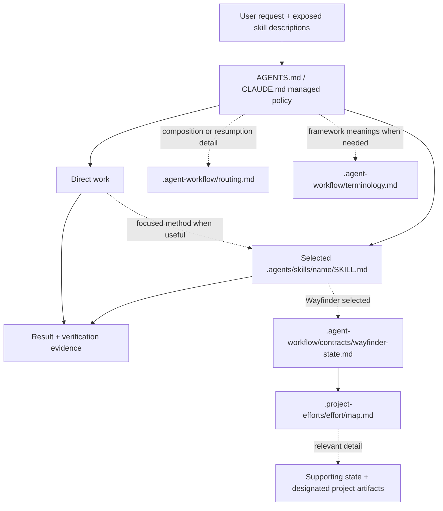

# Architecture and ownership

## Purpose

Agent Workflow is a thin instruction router over host capabilities and curated, replaceable skills.
Its pre-1.0 priorities are protecting project-owned data and making routing reliable while preserving action authorization and project decision authority.
It is not a general agent runtime, package manager, hook framework, analytics system, or duplicate store of accepted project results.

## Instruction runtime

The host loads project policy and exposes available skills.
The root policy starts with Direct work and selects one primary workflow plus useful supporting capabilities when warranted.
There is no daemon or host hook enforcing the route; reported execution still needs evidence.
Host permission does not itself authorize an action or commit a project choice.

| Instruction layer | Responsibility |
|---|---|
| [Root policy template](../agent_workflow/install/AGENTS.md.template) | Every-request routing, Wayfinder selection, authorization, decision authority, preservation, and truthful reporting. |
| [Detailed routing](../.agent-workflow/routing.md) | Composition, transitions, relevant resumption, unavailable-skill handling, and route reporting. |
| [Terminology](../.agent-workflow/terminology.md) | Shared framework meanings when they materially affect interpretation. |
| [Selected skills](../.agents/skills/) | The method and its supporting instructions. |
| [Wayfinder state contract](../.agent-workflow/contracts/wayfinder-state.md) | State representation, recognition, preservation, reconciliation, and map-first resumption after Wayfinder selection. |

Detailed instructions load when their responsibility becomes relevant.
Root obligations therefore remain effective before optional skills or contracts load.
Source-only documentation explains the system; it does not supply missing consumer instructions.

## Durable coordination

Wayfinder is Agent Workflow's sole durable coordinator.
Its map orients one effort and links the current coordination detail needed for continuation.
A map-only effort is valid.
Specifications, tickets, research, architecture decisions, and other lasting results remain with their designated maintaining artifacts; specialists do not create parallel Agent Workflow coordination systems.

The [Wayfinder skill](../.agents/skills/wayfinder/SKILL.md) owns navigation and method selection, while the state contract owns exact mechanics.
The [Wayfinder Effort skill](../.agents/skills/wayfinder-effort/SKILL.md) is a convenience entry point for orientation without product implementation.
See the [README examples](../README.md#wayfinder) for starting and resuming work.

## Source and consumer ownership

| Surface | In the source repository | In a consuming project |
|---|---|---|
| `.agent-workflow/` | Authored routing, terminology, contract, and third-party notice. | Reconstructable framework content, replaced as a unit. |
| Current `.agents/skills/<name>/` directories | Canonical maintained skill sources. | Reserved framework directories, replaced completely. |
| Managed root-policy regions | Authored through `agent_workflow/install/AGENTS.md.template` and `CLAUDE.md.template`. | Only the marked regions are managed; project-authored bytes outside them are preserved. |
| `.project-efforts/` | Project-owned effort state. | Project-owned effort state; lifecycle commands do not traverse, interpret, or change it. |
| Unrelated skill directories and project artifacts | Project-owned. | Project-owned. |

Maintainers edit the authored trees through Git and exercise lifecycle commands only in disposable consumers, following the [source-checkout ownership rule](../AGENTS.md#source-checkout-ownership).
The [installed README](../.agent-workflow/README.md) retains consumer-required information and the complete third-party notice.
Host support and replacement/recovery cautions are maintained in the [user guide](../README.md#replacement-and-recovery).

## Distribution and lifecycle

The Python implementation lives in `agent_workflow/`.
The root `VERSION` is the single authored framework/release version, and [`manifest.json`](../agent_workflow/install/manifest.json) maps snapshot-relative source paths to consumer targets.
It is a current distribution map, not installed state.

The installed [CLI](../agent_workflow/cli.py) delegates to [bootstrap](../agent_workflow/bootstrap.py), which selects the highest stable release by default, resolves an immutable commit, downloads a bounded and validated snapshot, and executes that snapshot's [lifecycle implementation](../agent_workflow/lifecycle.py).
Code, install metadata, framework content, and skills come from the same snapshot.
The Python wheel contains the CLI implementation and install resources; runtime framework and skill bodies come from the downloaded snapshot.

Lifecycle owns install, update, status, and remove.
It converges declared managed surfaces while preserving project-owned bytes, with preflight checks for unsafe managed paths and ambiguous composite ownership.
Remove additionally guards curated-name collisions on an unrecognized target.
There is no installed provenance store, migration engine, backup, or rollback transaction.
Exact checks belong in lifecycle/bootstrap source and tests; user recovery steps belong in the README.

The [package verifier](../agent_workflow/verify_package.py) is a maintainer/CI gate, not a consumer bootstrap stage.
The [verification runbook](verification.md) owns required checks and release procedures; [test ownership](../tests/README.md) and [evaluation evidence](../evals/README.md) describe their coverage and limits.

## Architectural decisions

Current source and accepted project artifacts outrank summaries and chat recollection.
The independently reconsiderable decisions are:

- [ADR-0010: Framework output and project-owned state](../architecture-decisions/0010-separate-framework-output-from-project-owned-state.md).
- [ADR-0011: Map-first Wayfinder state](../architecture-decisions/0011-use-map-first-wayfinder-state.md).
- [ADR-0025: Project decision authority at consequential boundaries](../architecture-decisions/0025-preserve-authority-at-consequential-boundaries.md).
- [ADR-0027: Direct-first progressive routing](../architecture-decisions/0027-use-direct-first-progressive-routing.md).
- [ADR-0028: Wayfinder as sole durable coordinator](../architecture-decisions/0028-use-wayfinder-as-sole-durable-coordinator.md).
- [ADR-0029: Canonical framework terminology](../architecture-decisions/0029-distribute-canonical-framework-terminology.md).
