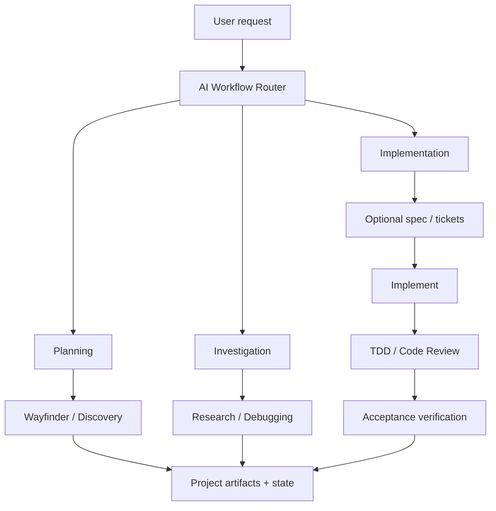

# Architecture and ownership

## Purpose

Agentic Workflow is an orchestration layer over curated upstream skills, not an
alternative skill library. The installed root policy classifies intent and
selects the minimum useful route. Mature provider skills own their detailed
methods and native artifacts. Local code owns only lifecycle safety,
project-specific authorization boundaries, durable orchestration pointers, and
acceptance/integration verification.

This division solves two problems: it avoids prompt and maintenance duplication,
and it keeps a stable project contract around methods that can evolve upstream.
The expected result is a compact always-on router whose selected workflows load
progressively from project-scoped `.agents/skills`.

## Runtime path



This overview emphasizes the multi-stage engineering routes. Explicitly named
skills, Teach, standalone Code Review, and clear low-risk work leave the router
directly; the complete selection rules remain in [Workflow routing](routing.md).

The root router contains capability names and composition constraints, not the
provider prompt bodies. `ai-workflow/providers.json` maps capabilities to the
tested pin after routing selects an upstream capability. Each skill directory
then participates in normal host progressive discovery.

`implement` owns its TDD and fixed-point Code Review subflows. The local
implementation adapter invokes `implement` once and the local verifier reuses
that evidence. The router does not invoke TDD or Code Review a second time merely
because they are available.

## Provider selection

The curated source is `mattpocock/skills` tag `v1.2.3`, immutable commit
`6acc160e4e0cd062dbbbd7a1b26ae92855edf07e`. The declaration records an exact
upstream path, tag, subtree SHA, and complete file inventory for every selected
skill. Directly routed capabilities are setup, Wayfinder, Teach, Research,
to-spec, to-tickets, implement, TDD, and Code Review. Grilling,
domain-modeling, prototype, and codebase-design are direct composition
dependencies and are installed to keep selected workflows complete.

The local framework deliberately retains:

- bounded Discovery, which is smaller than Wayfinder and preserves local
  decision-state semantics;
- Debugging, because its diagnosis-only authorization boundary, non-test signal
  handling, and durable interruption model are not equivalent to upstream
  `diagnosing-bugs`;
- an Implementation adapter, which connects native tickets/specifications to
  local authorization and acceptance verification without copying method text;
- Verification, which validates project acceptance and integration boundaries
  rather than repeating provider TDD or Code Review.

The framework retires its former Teach, Decomposition, and Review copies plus
the obsolete learning/ticket templates. Update removes those only when their
recorded bytes are unchanged; local changes are reclassified as project-owned.

## Setup and learning lifecycle

`setup-matt-pocock-skills` is installed as a dependency but is not run during
installation or on every prompt. It is prompt-driven and creates project-owned
tracker/domain configuration. The router invokes it visibly before the first
tracker-dependent provider workflow only when `docs/agents/issue-tracker.md` or
`docs/agents/domain.md` is missing.

Teach is selected only for explicit sustained learning intent. Its mission,
glossary, resources, lessons, and learning records belong in a dedicated
learning workspace. Ordinary knowledge questions remain direct and do not seed
course artifacts into an engineering repository.

## Distribution boundary

The source package is inert. Its resources do not mirror active repository
customization paths:

```text
payload/root/AGENTS.md.template  -> AGENTS.md
payload/skills/*/SKILL.md        -> .agents/skills/*/SKILL.md
payload/ai-workflow/...          -> ai-workflow/...
gh skill exact upstream paths    -> .agents/skills/<upstream-name>/...
```

`bootstrap.py` resolves and downloads an immutable framework revision and runs
the package verifier. `lifecycle.py` coordinates preflight and mutation.
`adopt.py` owns the local payload transaction. `providers.py` owns the curated
provider transaction through GitHub CLI. Installed repositories do not need the
source checkout or bootstrap package at runtime.

## Optional observability boundary

The installed `ai-workflow/observability/analyze.py` is a leaf utility, not a
runtime component. No root policy, local skill, provider skill, lifecycle
script, state template, or verification route imports or invokes it. It reads
only user-named telemetry exports, emits only to standard output, and uses no
database or third-party dependency. This preserves portable instruction-driven
routing even when VS Code, Copilot, OpenTelemetry, and SQLite are absent.

Native Agent Debug remains the per-session diagnostic UI, and an existing OTLP
collector/backend remains the production storage/dashboard path. The optional
normalizer adds only framework-aware, privacy-reduced cross-run summaries. Its
Preview format adapters and lifecycle decision are documented in
[Optional observability](observability.md).

## Provider lifecycle and pinning

GitHub CLI 2.97.0 or newer is the provider installer. `providers.py` calls
`gh skill install` with the exact upstream directory, `--pin v1.2.3`, project
scope, and the Codex target (which resolves to the common `.agents/skills`
location). It then independently validates:

- skill directory name and frontmatter name;
- injected repository, path, tag/ref, and tree-SHA metadata;
- the exact complete file set, including adjacent resources and
  `agents/openai.yaml`;
- SHA-256 of every installed file.

The framework does not call ordinary `gh skill update` during normal lifecycle
work because pinned skills are intentionally skipped. A provider upgrade is a
framework release change: maintainers review a new stable tag, update all
declared subtree/file identities, run live and hermetic compatibility checks,
then release. A target receives that baseline only through an explicit framework
update.

Install records each provider directory as `created` or
`preexisting-compatible`. Status is local and network-free. Remove deletes only
checksum-clean `created` directories and preserves pre-existing or changed
ones. Removal binds provider state back to the exact package declaration before
resolving a skill directory, so target-controlled state cannot broaden the
deletion set.

## Coordinated transaction boundary

A normal install preflights both payload and providers before writing either.
The payload transaction runs first because it supplies the provider declaration
and framework state locations; provider installation runs second. If the second
stage unexpectedly fails after preflight, framework-created provider directories
are rolled back, then the local payload is removed. Newly seeded profile/state
files are removed only if they did not predate the operation and still equal the
rendered seed. Project-created or modified content is preserved.

Update preflights the payload before staging a provider baseline. It replaces
only checksum-clean framework-created provider directories and only then updates
the payload. Removal preflights the payload, safely processes provider ownership,
then removes the payload. A machine crash or failing storage remains a reason to
use version-control or filesystem backup recovery; the framework does not claim
cross-process crash atomicity.

## Ownership

- Framework-owned payload content is updated only when its currently installed
  managed bytes match recorded checksums.
- Project seeds are created only when absent and never overwritten.
- Root `AGENTS.md` and a pre-existing `CLAUDE.md` are composite; the framework
  owns marked blocks and byte-preserves project sections.
- Same-named incompatible local or provider skills block installation before
  writes.
- Provider-native maps, tickets, specifications, learning records, and review
  output remain canonical. Framework records store only pointers and exact
  return targets.
- Provider instructions do not grant authorization to commit, publish, mutate
  trackers, or write setup/course artifacts.

## State precedence and identity

Accepted repository decisions and native provider artifacts outrank framework
pointers, which outrank private memory and chat recollection. Wayfinder's
configured tracker owns map and decision-ticket identities, labels, linked
titles, and map vocabulary. to-tickets similarly owns its ticket identity and
frontier. The framework never allocates a parallel `DEC`, `TKT`, `UNK`, or
learning alias for those artifacts.

Local identifiers remain only for distinct local concepts: `DEC` for bounded
Discovery decisions, `IMP` for durable implementation orchestration, `DBG` for
debugging, and optional `IDP` opportunities.
