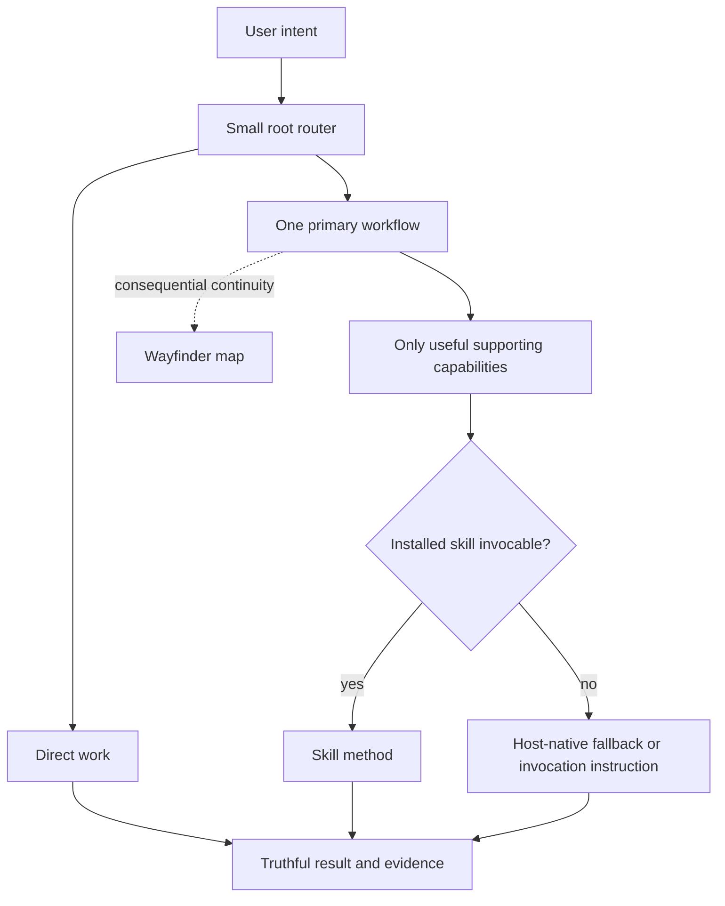

# Architecture and ownership

## Purpose

Agent Workflow is a thin instruction router over host capability and curated,
replaceable skills. Its core job is reliable minimum-workflow selection while
preserving action authorization, project decision authority, and project-owned
data. It is not a general agent runtime, package manager, hook framework,
analytics system, or second representation of the artifact designated to maintain the result.

The architecture optimizes for two pre-1.0 priorities:

1. do not destroy project-owned or user-owned data; and
2. make core routing behavior reliable.

## System topology



The root `AGENTS.md`, selected skills, and progressively loaded
`.agent-workflow/routing.md` form the instruction runtime. There is no lifecycle
controller, background daemon, telemetry service, or host hook enforcing the
route.

Routing begins Direct and classifies from user intent plus cheap installed-skill
descriptions. Detailed routing loads only when artifact responsibility,
composition, selected-skill fallback, a user invocation instruction, agent handoff, or
durable resumption is materially unclear. Routing may change as evidence
emerges. Route or workflow selection, supporting-capability selection, installed
skill resolution, skill invocation, material execution, and completion or verification
evidence remain distinct. Host sandboxing and approvals determine host
permission; that permission does not itself authorize an action or commit a
project choice.

Project-choice commitment and action authorization are separate gates. Required
evidence must be sufficient before accepted project policy determines a choice or
the person, role, or valid delegate with project decision authority commits it.
Writes and external mutations proceed only when the current user request or
accepted project policy authorizes that action and scope.

Wayfinder is Agent Workflow's sole durable coordination model. It keeps only
consequential continuity and references, while specialists retain their methods.
Specifications, local tickets or tracker issues, research results, and review
reports remain in their project or external locations. Each is the artifact
designated to maintain the result for its scope.

## Filesystem ownership

```text
FRAMEWORK-OWNED, RECONSTRUCTABLE
├── .agent-workflow/
├── managed AGENTS.md and CLAUDE.md regions
├── required mapped integration files
└── declared curated skill files under .agents/skills/

PROJECT-OWNED, DURABLE
└── .agent-wayfinder/
    └── <effort>/               # map-first Wayfinder coordination
        ├── map.md
        ├── facts.md            # optional current F# ledger
        ├── decisions.md        # optional current D# ledger
        ├── unknowns/           # optional independent U# files
        └── evidence/           # optional substantial E# files

OPTIONAL, INDEPENDENT
└── unrelated local skill directories under .agents/skills/
```

### Reconstructable framework output

`.agent-workflow/` is derived from the current package and may be replaced as a
unit. Missing, modified, obsolete, or extra files inside it do not require
historical checksum investigation. The current distribution manifest provides
an explicit source-to-target map rather than a historical ownership database.

The supported bootstrap and adoption path stores distributable root policies
under non-active template names. A maintainer check rejects literal root-policy
files and top-level host-customization trees inside the payload. Adoption
activates framework resources by projecting their explicit mappings into the
repository locations recognized by supported hosts.

`AGENTS.md` and `CLAUDE.md` are composite files. Lifecycle operations replace
only their unambiguous managed region and preserve project-region bytes. Other
required external paths use minimal recorded evidence so unrecognized or
subsequently changed content is preserved rather than overwritten or deleted.

### Project-owned durable state

`.agent-wayfinder/` and every entry below it are project-owned. Install and
update may establish the root when absent, but lifecycle operations never seed,
inventory, validate, checksum, merge, migrate, rewrite, or remove its contents.

Wayfinder efforts currently live directly at `.agent-wayfinder/<effort>/`.
Their `map.md` is the brief coordination summary and the first effort file read
when resuming. It summarizes the effort's current coordination state, conditions
blocking particular work, dependencies, and ready work. When no ticket or ticket
set exists, the map may state ready work directly. Once To Tickets maintains
detailed decomposition, that ticket or ticket set maintains
ticket contents, dependencies, ordering, and readiness; the map links it and may
include the current ready-work reference without mirroring ticket-level state.
New default maps retain `Blockers and dependencies` with `None` when no blocker
or dependency applies; other inapplicable empty headings may be omitted. Existing
maps remain valid without that heading or marker because this is authoring guidance,
not an effort-recognition schema or migration rule.
Optional `facts.md` and `decisions.md` ledgers hold current F# fact records and
D# decision records. F# contains a current scoped descriptive conclusion judged
sufficiently supported and remains revisable; D# contains a current choice
determined directly by accepted project policy or committed by the person, role,
or valid delegate with project decision authority. Independently useful U# unresolved
question records and E# evidence records with source, scope, observation, and
limitations remain separate files. The map indexes relevant detail rather than
duplicating those stores.
After map orientation, only the relevant ledger section or U#/E# file loads. If
most supporting artifacts are needed merely to recover the current route, the
effort is over-decomposed and needs reconciliation. This
intermediate-granularity default reduces unnecessary retrieval decisions
without treating one topology as universally superior.

Every current fact record identifies the source that establishes its conclusion
for the stated scope or the evidence or record from which it was derived, plus
material limitations. A D#'s presence means its choice is current and binding
under the project-choice gate; evidence may inform a recommendation or choice but
cannot commit it alone. The map represents current coordination state
and should converge as each lasting outcome moves to the artifact designated to
maintain the result. The progressively loaded Wayfinder state contract and its tests
define exact allocation, reconciliation, pruning, effort-ending, and reference
behavior.

This source repository's project instructions designate
`architecture-decisions/`. Elsewhere, a consuming project's declared convention
or the selected skill's artifact convention designates the location;
Agent Workflow imposes no additional ADR path. Wayfinder decision records may link an
ADR but do not become a parallel project-policy artifact.

## Curated skill boundary

The ordinary distribution manifest maps the complete fifteen-skill reviewed
payload directly into `.agents/skills/`. Declared files are reconstructable and
repairable; unrelated local skill directories are preserved. Skill availability
comes from the installed repository surface and behavior-bearing invocation
metadata.

Eleven curated skills are maintained derived works of Matt Pocock's `v1.2.3`
release. Their effective installed versions are the maintained runtime source;
complete repository, copyright, and MIT license attribution lives in
`.agent-workflow/THIRD_PARTY_NOTICES.md`. The frozen exact-transition fixture
retains separately identified historical bytes for three removed skills without
making them current runtime content.

Wayfinder's effective installed body uses one coherent map-first operational
model rather than layering local state rules over conflicting upstream tracker
mechanics. It uses objective, scope, areas and relationships,
unresolved-question or blocker language, ready work, readable names, and
progressive resolution.

Skill instructions do not authorize commits, publication, tracker mutation, or
broader external access and do not commit project choices. An unavailable or
non-invocable skill normally falls back to truthful host-native work unless the
user specifically requires that skill or a real safety boundary prevents
fallback.

## Lifecycle and bootstrap boundary

The public bootstrap resolves an immutable source revision and validates archive
shape and resource bounds before executing package code. `adopt.py` preflights
install-state integrity, project-data, composite, external-path, retirement, and
filesystem conflicts before applying current desired state. `lifecycle.py` is
the public wrapper for that one reconciliation operation.

`status` is read-only. `remove` deletes only lifecycle-managed framework-owned
reconstructable output,
strips managed composite regions, and preserves `.agent-wayfinder/` plus
unrecognized or changed external content. Transactions protect current data but do not claim
database-style crash semantics.

Current execution uses Python 3.11+ standard-library APIs on POSIX-style shells
for macOS, Linux, WSL, and Linux-based devcontainers. Native PowerShell and CMD
are not supported. These runtime and transport facts are current compatibility
documentation rather than architecture decisions.

The package is distributed through the repository-owned Python bootstrap rather
than `gh skill`. GitHub CLI 2.97.0 rewrites every nested `SKILL.md` during a
recursive skill install, which changes bundled nested-skill bytes and assigns the
outer package's provenance to inner skills; the current installer behavior is
visible in GitHub CLI's versioned
[`installSkill` implementation](https://github.com/cli/cli/blob/v2.97.0/internal/skills/installer/installer.go#L232-L285).
Changing transports therefore requires demonstrated byte preservation for the
complete package, not merely successful installation of the outer skill.

## Verification boundary

`verify_package.py` is a maintainer, CI, and release gate; bootstrap does not run
it for consumers. It checks package structure and activation-sensitive payload
paths, explicit mappings, routing and skill contracts, exact transition and attribution checks, deterministic
scenarios, local documentation links, and the test suite.

Tests focus on observable boundaries:

- route selection, installed-skill resolution, invocation truthfulness, material
  execution evidence, project-choice commitment, and action authorization;
- preservation of project-owned state and ambiguous external content;
- install, update, status, remove, and bootstrap behavior;
- coherent Wayfinder state and the direct installed skill surface;
- install-state integrity, exact former-installation proof, and transactional
  rollback; and
- preservation of unrelated skills, project composite bytes, and durable state.

Live-model evaluations remain opt-in evidence rather than deterministic release
requirements.

## State precedence

Live source and observed behavior establish current system facts for their
stated scope. Accepted ADRs and project documentation record project choices.
The artifact designated to maintain the result remains authoritative for that
result. `.agent-wayfinder/` is the
project-owned durable representation of local workflow continuity. These sources
and artifacts outrank summaries, private agent memory, and chat recollection.

Current architectural rationale is intentionally limited to:

- [ADR-0010 — Framework output and project-owned state](../architecture-decisions/0010-separate-framework-output-from-project-owned-state.md)
- [ADR-0011 — Map-first Wayfinder state](../architecture-decisions/0011-use-map-first-wayfinder-state.md)
- [ADR-0025 — Project decision authority at consequential boundaries](../architecture-decisions/0025-preserve-authority-at-consequential-boundaries.md)
- [ADR-0027 — Direct-first progressive routing](../architecture-decisions/0027-use-direct-first-progressive-routing.md)
- [ADR-0028 — Wayfinder as sole durable coordinator](../architecture-decisions/0028-use-wayfinder-as-sole-durable-coordinator.md)

See also [Workflow routing](routing.md) and [Verification](verification.md) for
current operational detail.
