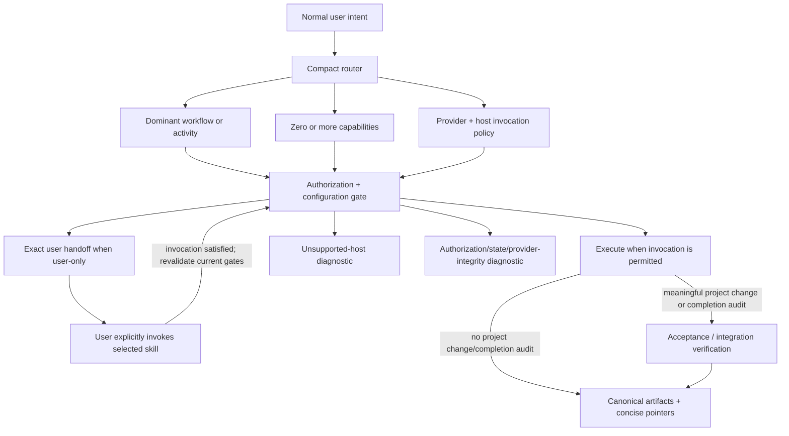

# Architecture and ownership

## Purpose

Agentic Workflow is an orchestration layer over curated upstream skills, not an
alternative skill library. The installed root policy classifies intent and
selects the minimum useful route. Mature provider skills own their detailed
methods and native artifacts. Local code owns only lifecycle safety,
project-specific authorization boundaries, durable orchestration pointers, and
acceptance/integration verification.

This division solves two problems: it avoids prompt and maintenance duplication,
and it keeps a stable project contract around methods that can evolve upstream.
The expected result is a compact always-on router whose invoked workflow bodies
load progressively from project-scoped `.agents/skills`; user-only selection
alone does not load them.

## Runtime path



Classification, invocation capability, execution, and authorization are
separate decisions. The router can correctly select Wayfinder from ordinary
intent even when the active host requires the user to invoke it. In that case it
returns the exact host syntax and records neither execution nor durable state.
It never substitutes a weaker local workflow or copies the provider method.

The dominant workflow is the durable continuity owner when persistence is
needed. Research, Teach, Debugging, TDD, Verification, or Code Review may be a
standalone dominant activity or a capability composed inside another workflow.
Supporting use does not itself transition durable state. This is an
instruction-level composition contract, not a scheduler or workflow engine.
The complete selection rules remain in [Workflow routing](routing.md).

The root router contains capability names and composition constraints, not the
provider prompt bodies. `ai-workflow/providers.json` maps capabilities to the
tested pin after routing selects an upstream capability. Each skill directory
then participates in normal host progressive discovery.

`implement` owns its TDD and fixed-point Code Review subflows. The local
implementation adapter returns the exact handoff when required; after permitted
model invocation or explicit user invocation, it passes control to `implement`
once and the local verifier reuses that evidence. The router does not invoke TDD
or Code Review a second time merely because they are available.

## Provider selection

The curated source is `mattpocock/skills` tag `v1.2.3`, immutable commit
`6acc160e4e0cd062dbbbd7a1b26ae92855edf07e`. The declaration records an exact
upstream path, tag, subtree SHA, and complete file inventory for every selected
skill. Routed capabilities are Wayfinder, Teach, Research, to-spec, to-tickets,
implement, TDD, and Code Review. Setup is an explicit configuration operation.
Grilling, domain-modeling, prototype, and codebase-design are composition
dependencies. `triage` is an installed configuration dependency: its presence
causes setup to provision the triage-label vocabulary required by to-spec and
to-tickets, but it is not promoted to a normal root route.

The provider declaration records two orthogonal mappings: capabilities select
skills, while every skill separately declares configuration prerequisites and
per-host invocation behavior. Deterministic verification derives Codex policy
from pinned `agents/openai.yaml`, Copilot policy from pinned `SKILL.md`
frontmatter, and fails when declared semantics diverge from those exact files.
Codex and GitHub Copilot are supported through `.agents/skills`; Claude Code's
native project-skill location is `.claude/skills`. The root `CLAUDE.md` policy
remains useful for classification and direct work, but neither local nor
provider skill bodies are projected there, so every skill-backed route is
reported unavailable rather than represented as full workflow support.

The local framework deliberately retains:

- bounded Discovery, which is smaller than Wayfinder and preserves local
  decision-state semantics;
- Debugging, because its diagnosis-only authorization boundary, non-test signal
  handling, and durable interruption model are not equivalent to upstream
  `diagnosing-bugs`;
- an Implementation adapter, which connects native tickets/specifications to
  local authorization and acceptance verification without copying method text;
- Verification, which validates project acceptance and integration boundaries
  rather than repeating provider TDD or Code Review.

The framework retires its former Teach, Decomposition, and Review copies plus
the obsolete learning/ticket templates. Update removes those only when their
recorded bytes are unchanged; local changes are reclassified as project-owned.

## Setup and learning lifecycle

`setup-matt-pocock-skills` is installed as a dependency but is not run during
installation or on every prompt. It is prompt-driven and user-only on Codex and
GitHub Copilot at the pinned release; it is unavailable on Claude Code. Setup
creates project-owned tracker, domain, and triage-label configuration. Only
after selecting a configuration-dependent workflow does the router check that
skill's declared prerequisites. If one is absent, the router selects setup and
returns `$setup-matt-pocock-skills` for Codex or
`/setup-matt-pocock-skills` for Copilot. It does not claim setup ran or write an
artifact. Unrelated direct work remains immediately available.

Lifecycle output separates clean installation from project readiness. A clean
framework/provider install may still report an uninitialized profile or missing
setup configuration as warnings. Those warnings do not make normal status fail.
The profile is seeded in a deterministic `uninitialized` state with `None` for
unknown facts; initialization and later maintenance require verified durable
evidence and write authorization, and do not trigger an automatic full-repository
scan.

Teach is selected only for explicit sustained learning intent. Its mission,
glossary, resources, lessons, and learning records belong in a dedicated
learning workspace. Ordinary knowledge questions remain direct and do not seed
course artifacts into an engineering repository.

## Distribution boundary

The source package is inert. Its resources do not mirror active repository
customization paths:

```text
payload/root/AGENTS.md.template  -> AGENTS.md
payload/root/CLAUDE.md.template  -> CLAUDE.md
payload/skills/*/SKILL.md        -> .agents/skills/*/SKILL.md
payload/ai-workflow/...          -> ai-workflow/...
gh skill exact upstream paths    -> .agents/skills/<upstream-name>/...
```

`bootstrap.py` resolves and downloads an immutable framework revision and runs
the package verifier. `lifecycle.py` coordinates preflight and mutation.
`adopt.py` owns the local payload transaction. `providers.py` owns the curated
provider transaction through GitHub CLI. Installed repositories do not need the
source checkout or bootstrap package at runtime.

The schema-3 distribution manifest authenticates both the current payload and
an explicit set of historical predecessor identities. A cross-version update
selects a predecessor only by exact framework version, immutable source
revision, installation-manifest schema, complete managed-path set, and every
recorded source SHA-256. Same-version operations require the exact current
source inventory. Unknown revisions, partial maps, invented paths, and changed
source hashes fail before planning writes or retirements. Historical records
are separately audited package data; refreshing current payload checksums does
not discover or legitimize another predecessor. The target-local schema-2
`install-manifest.json` remains ownership and cleanliness evidence, not the
authority that defines an accepted source identity.

## Optional observability boundary

The installed `ai-workflow/observability/analyze.py` is a leaf utility, not a
runtime component. No root policy, local skill, provider skill, lifecycle
script, state template, or verification route imports or invokes it. It reads
only user-named telemetry exports, emits only to standard output, and uses no
database or third-party dependency. This preserves portable instruction-driven
routing even when VS Code, Copilot, OpenTelemetry, and SQLite are absent.

Native Agent Debug remains the per-session diagnostic UI, and an existing OTLP
collector/backend remains the production storage/dashboard path. The optional
normalizer adds only framework-aware, privacy-reduced cross-run summaries. Its
Preview format adapters and lifecycle decision are documented in
[Optional observability](observability.md).

## Provider lifecycle and pinning

GitHub CLI 2.97.0 or newer is the provider installer. `providers.py` calls
`gh skill install` with the exact upstream directory, `--pin v1.2.3`, project
scope, and the Codex target (which resolves to the common `.agents/skills`
location). It then independently validates:

- skill directory name and frontmatter name;
- injected repository, path, tag/ref, and tree-SHA metadata;
- the exact complete file set, including adjacent resources and
  `agents/openai.yaml`;
- package-owned canonical source SHA-256 of every file. Installed `SKILL.md`
  bytes are normalized only by removing the exact GitHub-injected provenance
  block after all of its expected keys and values pass validation.

The verifier also binds the complete provider identity projection—repository,
version, revision, skill paths, subtree SHAs, inventories, and per-file source
hashes—to a separately reviewed static digest. Generated payload-manifest
refresh cannot normalize a changed provider identity into that lock.

The framework does not call ordinary `gh skill update` during normal lifecycle
work because pinned skills are intentionally skipped. A provider upgrade is a
framework release change: maintainers review a new stable tag, update all
declared subtree/file identities, run live and hermetic compatibility checks,
then release. A target receives that baseline only through an explicit framework
update.

Initial adoption stages the exact pin independently and compares any
pre-existing provider directory byte-for-byte before recording it as
`preexisting-compatible`; mutable injected metadata alone is not content
identity. Once the exact framework package and authenticated provider baseline
are recorded, the inner status checks are local and do not contact the provider
upstream; the public bootstrap still needs HTTPS to fetch that recorded package.
Local status treats declaration source hashes as content authority and state
hashes only as installation-cleanliness evidence.

Across a declaration change, update rejects unknown old-state skill names,
stages the complete new pin, authenticates every existing declared directory
against it, downgrades retained directories to `preexisting-compatible`, and
adds only missing declared directories. It never removes or replaces an
existing provider directory during the transition. This permits a same-pin
dependency-set addition such as 0.7.0's `triage` migration; a future pin with
changed canonical bytes fails closed until the owner explicitly reconciles the
directory or completes remove-then-install.

Remove considers only exact current declaration names. It deletes a directory
only when package source identities authenticate its complete inventory, its
recorded checksums are still clean, and its origin is `created`; incompatible,
modified, extra-file, undeclared, and `preexisting-compatible` directories are
preserved. Origin history is repository-local evidence, not tamper-evident:
coordinated forgery can reclassify an exact unmodified canonical directory, but
cannot authorize deletion of modified, extra-file, or undeclared content.

## Coordinated transaction boundary

A normal install preflights both payload and providers before writing either.
The payload transaction runs first because it supplies the provider declaration
and framework state locations; provider installation runs second. If the second
stage unexpectedly fails after preflight, framework-created provider directories
are rolled back, then the local payload is removed. Newly seeded profile/state
files are removed only if they did not predate the operation and still equal the
post-install snapshot. Seed targets come from the authenticated distribution
manifest rather than a duplicate lifecycle list. Project-created or modified
content and parent directories that predated the operation are preserved.

Within the payload transaction, install and update run their integrity
post-check before commit. A post-check or atomic-write failure restores all
replaced/deleted bytes and modes and removes only parent directories created by
that transaction. Successful removal deletes owned files but does not prune
untracked empty parents, because the framework has no durable proof that it
created those directories.

Update preflights the payload before staging a changed provider baseline. It
preserves every existing provider directory, authenticates retained declared
directories, adds only missing ones, and only then updates the payload. Removal
preflights the payload, safely processes bounded provider ownership, then
removes the payload. A machine crash or failing storage remains a reason to use
version-control or filesystem backup recovery; the framework does not claim
cross-process crash atomicity.

## Ownership

- Framework-owned payload content is updated only when its currently installed
  managed bytes match recorded checksums.
- Project seeds are created only when absent and never overwritten.
- Root `AGENTS.md` and `CLAUDE.md` are composite, including fresh framework
  creation; the framework owns marked blocks and byte-preserves project
  sections. For an exact pre-existing policy, schema-2 installation state also
  retains checksum-validated restoration bytes so later managed-source updates
  cannot erase the removal baseline. Update migrates schema-1 exact-policy and
  previous clean fully-owned `CLAUDE.md` records into this model before normal
  setup/project edits.
- Payload origin and restoration fields, like provider origin, are
  repository-local history and not tamper-evident proof. The architecture
  deliberately accepts that coordinated manifest forgery can reclassify or
  substitute exact canonical current or audited historical policy bytes. It
  cannot authorize deletion of modified managed bytes, invented source
  identities, extra provider content, undeclared paths, or unique project
  content. Eliminating this bounded limitation would require conservative
  no-delete semantics or a trust anchor outside the target repository.
- Same-named incompatible local or provider skills block installation before
  writes.
- Provider-native maps, tickets, specifications, learning records, and review
  output remain canonical. Framework records store only pointers and exact
  return targets.
- Provider instructions do not grant authorization to commit, publish, mutate
  trackers, or write setup/course artifacts.

## State precedence and identity

Live/source evidence is authoritative for current behavior. Accepted ADRs and
domain documentation are canonical for project decisions; native provider
artifacts are canonical for provider-owned outputs; the project profile is only
a concise verified cache and pointer layer. All outrank private memory and chat
recollection. Wayfinder's configured tracker owns map and decision-ticket
identities, labels, linked titles, and map vocabulary. to-tickets similarly owns
its ticket identity and frontier. The framework never allocates a parallel
`DEC`, `TKT`, `UNK`, or learning alias for those artifacts.

`state/active.md` represents one durable active framework workflow per
repository. Capabilities may compose inside it without taking over the pointer.
A conflicting second durable workflow must be resolved explicitly—complete,
interrupt, or supersede the first—rather than overwritten. Ephemeral direct and
read-only work can proceed when it does not interfere, so this remains a small
file contract rather than a lock service or concurrency runtime.

Local identifiers remain only for distinct local concepts: `DEC` for bounded
Discovery decisions, `IMP` for durable implementation orchestration, `DBG` for
debugging, and optional `IDP` opportunities.
