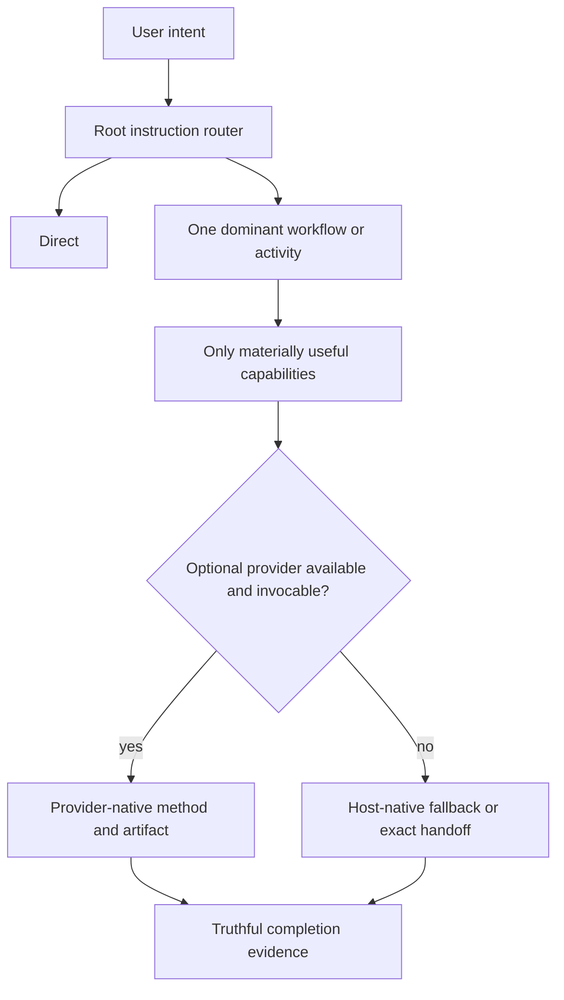

# Architecture and ownership

## Purpose

Agentic Workflow is a thin instruction router over host capability and optional,
replaceable skills. Its core job is reliable minimum-workflow selection while
preserving authorization and project-owned data. It is not a general runtime,
package manager, hook framework, analytics system, or second representation of
provider artifacts.

This boundary addresses two current problems: agents otherwise load too much
process for simple work, and lifecycle machinery can mistake missing historical
files for corruption. The expected result is direct handling for bounded work,
progressive loading for consequential work, and update behavior that converges
to current desired state.

## Runtime boundary



The root `AGENTS.md` policy and `.ai-workflow/routing.md` are the runtime. There
is no lifecycle controller or host hook adapter. Host sandboxing and approvals
remain authoritative. The router separates selection, provider invocation,
authorization, execution, and completion evidence; none of those decisions
expands another.

The router may reclassify work after it starts. Wayfinder becomes appropriate
when several important state distinctions would be unsafe to leave only in
ordinary conversational context, not only when a prompt announces a huge
multi-session effort. Bounded work remains direct or in its existing local
workflow, and read-only work does not gain durable state authority.

Durable workflows resume from their canonical record or map when persistence is
useful. Supporting Research, TDD, Verification, or Code Review does not create a
second continuity record. Provider-native tickets, specifications, research,
and learning artifacts remain canonical; framework records store only concise
orchestration pointers. Local Wayfinder maps and U#/D#/T# children live under
`.ai-workflow-state/wayfinder/` and use the effort map for re-entry.

A required response marker such as
`[route: router -> discovery -> research]` provides sufficient v0 route
visibility. It is not telemetry, execution evidence, or a routing prerequisite.

## Filesystem ownership

```text
FRAMEWORK-OWNED, RECONSTRUCTABLE
├── .ai-workflow/
├── managed AGENTS.md and CLAUDE.md regions
└── recorded agent integration files at required external paths

PROJECT-OWNED, DURABLE
└── .ai-workflow-state/
    ├── project-profile.md      # optional
    ├── records/                # optional
    ├── archive/                # optional
    └── wayfinder/              # optional canonical local maps and U#/D#/T# state

OPTIONAL, INDEPENDENT
└── upstream provider directories under .agents/skills/
```

### Reconstructable framework state

`.ai-workflow/` contains only files derived from the current package plus its
small install manifest. It is disposable. Install and update stage a new current
directory and replace the old one as a unit. Missing, modified, obsolete, or
extra files inside it need no historical checksum investigation.

The distribution manifest contains only the current framework version and
source-to-target install map. Runtime reads actual source bytes. Ordinary
content edits require no metadata refresh; adding, removing, or remapping a
packaged file requires an explicit map refresh. There is no retired path catalog
or duplicate payload checksum inventory.

The target-local schema-1 install manifest contains only:

- framework version and source revision;
- external required files with a created flag and last-written hash; and
- composite paths with the fact that the framework created the file.

External hashes exist only to avoid deleting a pre-existing or subsequently
modified file during removal. They are not an integrity system and do not block
repair of current managed content.

### Durable project state

`.ai-workflow-state/` and every entry below it are project-owned. Lifecycle
operations ensure the directory exists during install/update, but never seed,
inventory, checksum, merge, rewrite, or remove its contents. Missing optional
profile, record, archive, and Wayfinder files are normal. An existing
`.ai-workflow-state/active.md` is preserved as opaque legacy project data but is
not a current routing or re-entry artifact.

When Wayfinder needs Git-native structured state, its dedicated progressively
loaded contract configures `.ai-workflow-state/wayfinder/<effort>/` as the
canonical local representation. It creates no global index, shadow `.scratch/`
tree, persisted frontier, lifecycle schema, or external-tracker sync. The map
itself is the re-entry point, and human edits remain opaque project data to
lifecycle code.

Accepted, lasting architecture or contract decisions use `docs/decisions/` as
the default ADR namespace. An existing project instruction may name another
canonical location; the framework preserves that convention instead of creating
a parallel namespace or migrating it. Local `DEC-NNNN` and Wayfinder `D#`
records remain workflow state and link to the applicable ADR when a decision is
promoted.

Only four development-era sources receive compatibility handling:
`.ai-workflow/project-profile.md` and
`.ai-workflow/state/{active.md,records,archive}`. The old active index moves to
the inert `.ai-workflow-state/legacy-active.md` filename solely to avoid data
loss; it is not interpreted. Each missing source is ignored. An absent
destination receives the original entry, an identical destination is accepted,
and a differing or unsafe destination stops before mutation. No other migration
framework exists.

### Composite root policies

`AGENTS.md` and `CLAUDE.md` use one managed region followed by one project region.
On a first install, an unmarked existing file becomes project-region bytes.
Update replaces only the parsed managed region. Duplicate, partial, or reordered
markers are ambiguous and stop before any write. Removal strips the managed
region and restores the project bytes; a composite created from nothing is
deleted when its project region is empty.

This boundary eliminates encoded restoration blobs. The previous pre-1.0
manifest is read only narrowly enough to carry an authenticated pre-existing
policy into the project region on its next update.

### Other external integrations

Required local skill files live under `.agents/skills` because hosts discover
them there. A missing target is created. Exact pre-existing bytes are reused but
recorded as pre-existing. A different unrecorded file is an unknown collision
and blocks installation. Once recorded as managed, update may replace it with
current desired bytes. Removal deletes it only when the framework created it and
its bytes still match the last-written external hash.

An external target removed from the current mapping is derived only from the
previous local install manifest. Absence is a no-op. An unchanged created copy
is removed; changed or uncertain content is preserved and then forgotten. This
is sufficient for v0 and avoids a historical retirement database.

## Optional providers

`.ai-workflow/providers.json` maps routed capabilities to a reviewed upstream
tag, resolved commit, tag object, upstream tree, MIT license, and checksummed
snapshot. The release contains only the 14 declared skill directories, not the
upstream repository. Runtime installation copies that snapshot into a temporary
same-filesystem staging root, applies the declared adapters there, validates the
complete effective projection, and moves all missing directories together. It
does not require GitHub CLI, Git, npm, npx, authentication, or network access.

An exact existing effective directory is reused without claiming ownership. A
differing, malformed, older, independently installed, or locally modified
same-named directory is preserved as a conflict. Any conflict blocks every
missing directory in the declared set, so the router never receives a newly
partial dependency graph. A projection or validation failure still never
invalidates a successful core operation.

The pinned Wayfinder provider retains its reasoning method and terminology. A
clearly delimited local-mode section precedes the unchanged provider method and
adapts its configured storage, re-entry, and item lifecycle: low-resolution
maps, fog of war, named links, and dependency-derived frontier semantics remain
provider-aligned, while local persistence moves from the provider's default
`.scratch/` tracker to project-owned U#/D#/T# state. The same adapter changes
Wayfinder's host invocation flags and discovery descriptions so Codex and
GitHub Copilot may select it implicitly at the framework's notebook threshold.
This remains a narrow integration boundary because Agentic Workflow owns
routing and local storage; it does not rewrite the upstream method below the
adapter. Claude remains unavailable because no native skill projection exists
for that host.

The framework keeps no target ownership database, installed-file history,
quarantine store, automatic upgrade engine, or automatic deletion behavior.
The snapshot checksum protects the release artifact; exact effective-tree
comparison protects project-owned target bytes. Updates fill missing directories
only when all present declarations match the current release. A release with a
new provider snapshot therefore reports an old or modified target as a conflict
instead of replacing it. Removal preserves provider directories and keeps
cleanup manual. These constraints make providers optional capabilities instead
of a second package manager.

Capability routing and invocation policy remain distinct. An absent or
user-only provider normally falls back to truthful host-native work. An exact
handoff is used only when the user explicitly requires the provider or the host
cannot cross a real configuration boundary. Provider instructions never grant
permission to commit, publish, mutate a tracker, or broaden an external scope.

## Lifecycle and transaction boundary

The public bootstrap owns only consumer download safety:

- immutable revision resolution;
- bounded archive bytes, members, and member sizes;
- rejection of corrupt archives, traversal, absolute paths, duplicates, links,
  special entries, and unreviewed modes; and
- presence of the minimum lifecycle entrypoints and mapping metadata.

`adopt.py` preflights durable-state conflicts, composite boundaries, external
collisions, and target symlinks before mutation. External writes are snapshotted
and atomic; the new `.ai-workflow/` tree is staged and swapped. A detected
operation failure restores prior external bytes and the prior reconstructable
directory where possible. These transactions protect current data; the project
does not claim crash-safe database semantics.

`lifecycle.py` runs core reconciliation first and optional provider installation
second. The transactions are intentionally independent, so provider failure
cannot roll back or invalidate the core.

`status` is read-only. It reports `healthy`, `repairable`, or
`unsafe/conflict` for core reconciliation. Missing optional project-state files
and provider skills do not change a healthy core exit status.

`remove` migrates any named legacy durable state, strips composite regions,
deletes only safely recorded external files, removes `.ai-workflow/`, and
preserves `.ai-workflow-state/` plus all providers.

## Verification boundary

`verify_package.py` is a maintainer/CI/release gate, not an adoption prerequisite.
It checks the current explicit mapping and version, safe package paths and modes,
routing/provider contracts, documentation links, scenario catalogs, and the
acceptance suite. A stale file inventory or mapping can fail CI without making
safe current mapped package bytes unavailable to an end user.

Tests prioritize four boundaries:

1. route selection, invocation truthfulness, and authorization;
2. project-owned data and composite/external collision safety;
3. basic install, update, status, remove, and archive smoke behavior; and
4. provider-failure isolation.

They do not reproduce provider internals or maintain obsolete controller and
telemetry contracts.

## Portability

Lifecycle code uses Python 3.11+ standard-library filesystem APIs and
`PurePosixPath` for package identities. It does not require Git, a daemon,
database, container runtime, or a particular editor layout. CLI messages are
ASCII; dynamic text is emitted with backslash replacement on restrictive
consoles such as Windows cp1252.

Live validation on one platform is reported separately from portability by
design. Archive fixtures and temporary-project tests are hermetic evidence, not
claims that every host or operating system was exercised live.

## State precedence

Live source and observed behavior are authoritative for current system facts.
Accepted repository decisions and documentation own project decisions;
provider-native artifacts own provider output; `.ai-workflow-state/` owns local
workflow continuity, including canonical local Wayfinder efforts; an optional
project profile is only an advisory cache. All of these outrank private agent
memory and chat recollection.

See [Workflow routing](routing.md), [Verification](verification.md), and
[ADR-0010](decisions/0010-separate-lifecycle-safety-and-reconciliation.md) plus
[ADR-0011](decisions/0011-use-project-owned-wayfinder-state.md),
[ADR-0012](decisions/0012-remove-global-active-index.md),
[ADR-0013](decisions/0013-enable-automatic-wayfinder-routing.md), and
[ADR-0015](decisions/0015-adapt-wayfinder-effective-local-mode.md), plus
[ADR-0016](decisions/0016-reconcile-relevant-wayfinder-state-at-completion.md).
