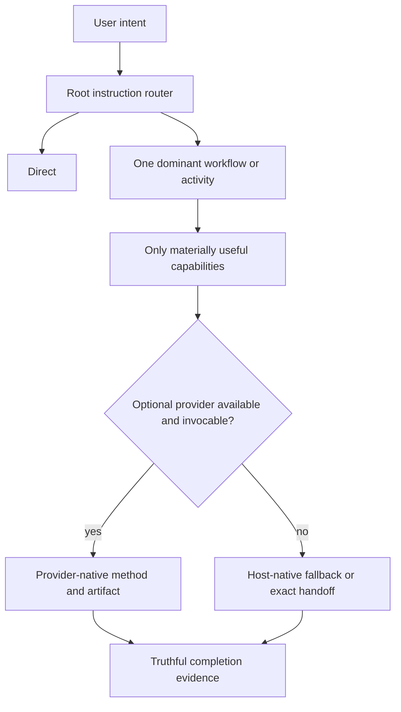

# Architecture and ownership

## Purpose

Agentic Workflow is a thin instruction router over host capability and optional,
replaceable skills. Its core job is reliable minimum-workflow selection while
preserving authorization and project-owned data. It is not a general runtime,
package manager, hook framework, analytics system, or second representation of
provider artifacts.

This boundary addresses two current problems: agents otherwise load too much
process for simple work, and lifecycle machinery can mistake missing historical
files for corruption. The expected result is direct handling for bounded work,
progressive loading for consequential work, and update behavior that converges
to current desired state.

## Runtime boundary



The root `AGENTS.md` policy, selected skills, and progressively loaded
`.agent-workflow/routing.md` are the runtime. There is no lifecycle controller or
host hook adapter. The root starts Direct, uses installed skill descriptions as
the cheap selection interface, and loads the detailed router only for unresolved
ambiguity, composition, material provider fallback, or unclear durable-resume
ownership. Host sandboxing and approvals remain authoritative. Selection,
provider invocation, authorization, execution, and completion evidence remain
distinct.

The router may reclassify work after it starts. Item count prompts assessment but
does not select Wayfinder. Any hard continuity/conflict/authority/provenance
signal or at least two softer interaction/dependency/reconstruction signals may
cross the durable threshold. Bounded work remains Direct or in its existing
workflow, and read-only work does not gain durable state authority.

Wayfinder is the framework's sole durable coordination layer. It resumes from
its effort map and lazily delegates reasoning to stateless specialists only when
their method materially helps the current frontier. Provider-native tickets,
specifications, research, reviews, and learning artifacts remain canonical;
Wayfinder stores only consequential coordination and pointers. Its maps and
optional U#/E#/F#/D# knowledge live under
`.agent-workflow-state/wayfinder/`.

A required response marker such as
`[route: router -> discovery -> research]` provides sufficient v0 route
visibility. It is not telemetry, execution evidence, or a routing prerequisite.

## Filesystem ownership

```text
FRAMEWORK-OWNED, RECONSTRUCTABLE
├── .agent-workflow/
├── managed AGENTS.md and CLAUDE.md regions
└── recorded agent integration files at required external paths

PROJECT-OWNED, DURABLE
└── .agent-workflow-state/
    ├── project-profile.md      # optional
    └── wayfinder/              # optional map-first U#/E#/F#/D# knowledge state

OPTIONAL, INDEPENDENT
└── upstream provider directories under .agents/skills/
```

### Reconstructable framework state

`.agent-workflow/` contains only files derived from the current package plus its
small install manifest. It is disposable. Install and update stage a new current
directory and replace the old one as a unit. Missing, modified, obsolete, or
extra files inside it need no historical checksum investigation.

The distribution manifest contains only the current framework version and
source-to-target install map. Runtime reads actual source bytes. Ordinary
content edits require no metadata refresh; adding, removing, or remapping a
packaged file requires an explicit map refresh. There is no retired path catalog
or duplicate payload checksum inventory.

The target-local schema-1 install manifest contains only:

- framework version and source revision;
- external required files with a created flag and last-written hash; and
- composite paths with the fact that the framework created the file.

External hashes exist only to avoid deleting a pre-existing or subsequently
modified file during removal. They are not an integrity system and do not block
repair of current managed content.

### Durable project state

`.agent-workflow-state/` and every entry below it are project-owned. Lifecycle
operations ensure the directory exists during install/update, but never seed,
inventory, checksum, merge, rewrite, or remove its contents. Missing optional
profile and Wayfinder files are normal. Legacy record and archive paths are
preserved as opaque historical project data rather than resumed or migrated by
current workflows.

When Wayfinder needs Git-native structured state, its dedicated progressively
loaded contract configures `.agent-workflow-state/wayfinder/<effort>/` as the
canonical local representation. It creates no global index, shadow `.scratch/`
tree, persisted frontier, lifecycle database, or external-tracker sync. The map
itself is the re-entry point and may carry one compact current/completed/
abandoned/superseded status. U/E/F/D identifiers are stable references only
within current state; Git preserves historical states that actually enter Git
but is not a retirement gate. Human Wayfinder state remains opaque project data
to lifecycle code. Atomic creation of one empty transient per-effort lock
directory serializes map and child mutations, preventing different readable
slugs from concurrently claiming the same number and making reference-safe
retirement indivisible without durable allocation state.

Bare U#/E#/F#/D# references are effort-local current-state shorthand. Readable
child filenames are canonical paths; durable references from ADRs,
specifications, tickets, or other artifacts outside the effort use
repository-relative Markdown links with readable labels instead of treating a
bare number as repository-wide identity.

Accepted, lasting architecture or contract decisions use `/` as
the default ADR namespace. An existing project instruction may name another
canonical location; the framework preserves that convention instead of creating
a parallel namespace or migrating it. Wayfinder `D#` entries remain
effort-local coordination state and link to the applicable ADR when a decision
is promoted. Legacy `DEC-NNNN`, `IMP-NNNN`, and `DBG-NNNN` files are historical
project data, not current workflow records.

### Composite root policies

`AGENTS.md` and `CLAUDE.md` use one managed region followed by one project region.
On a first install, an unmarked existing file becomes project-region bytes.
Update replaces only the parsed managed region. Duplicate, partial, or reordered
markers are ambiguous and stop before any write. Removal strips the managed
region and restores the project bytes; a composite created from nothing is
deleted when its project region is empty.

This boundary eliminates encoded restoration blobs.

### Other external integrations

Required local skill files live under `.agents/skills` because hosts discover
them there. A missing target is created. Exact pre-existing bytes are reused but
recorded as pre-existing. A different unrecorded file is an unknown collision
and blocks installation. Once recorded as managed, update may replace it with
current desired bytes. Removal deletes it only when the framework created it and
its bytes still match the last-written external hash.

An external target removed from the current mapping is derived only from the
previous local install manifest. Absence is a no-op. An unchanged created copy
is removed; changed or uncertain content is preserved and then forgotten. This
is sufficient for v0 and avoids a historical retirement database.

## Optional providers

`.agent-workflow/providers.json` maps routed capabilities to a reviewed upstream
tag, resolved commit, tag object, upstream tree, MIT license, and checksummed
snapshot. The release contains only the 14 declared skill directories, not the
upstream repository. Runtime installation copies that snapshot into a temporary
same-filesystem staging root, applies the declared adapters there, validates the
complete effective projection, and reconciles all missing or different declared
directories together. It does not require GitHub CLI, Git, npm, npx,
authentication, or network access.

The finite declared set is framework-owned reconstructable output. An exact
effective directory is reused; a missing, malformed, older, raw-upstream, or
locally modified declared directory is repairable and replaced from staging.
Unsafe paths such as symlinks or non-directories block all provider changes
before mutation. Unrelated `.agents/skills/` directories are preserved. A
projection or validation failure still never invalidates a successful core
operation.

Wayfinder is the explicit exception to normal provider-method ownership.
Agentic Workflow owns a concise effective runtime derived from Matt Pocock's
Wayfinder methodology; the pinned raw snapshot remains unchanged as reviewed
provenance and reference. During staging, one explicit adapter validates that
recognized input, retains compatible provenance frontmatter, applies the
reviewed host-invocation metadata, and replaces the upstream tracker body with
the package-owned runtime body.

The owned runtime retains destination, low-resolution map, fog, frontier,
readable-name, and progressive-resolution concepts while defining project-owned
map-first U/E/F/D state, effort selection, continuation, concurrency, and the
`to-tickets` boundary. It does not append issue assignment, tracker blocking,
resolution comments, required tracker setup, or `.scratch/` fallback mechanics.
A Claude model inside GitHub Copilot uses this shared host projection; native
Claude Code remains unavailable because no native projection exists for that
host.

The framework keeps no target ownership database, installed-file history,
quarantine store, or automatic upgrade engine.
The declaration itself is the narrow ownership boundary. The maintainer gate
binds the snapshot checksum, provenance, and license to the reviewed release;
end-user lifecycle operations do not repeat that release bookkeeping. Runtime
checks only the inventory, safe filesystem shape, references, and adapter
preconditions needed to build a usable projection. Exact effective-tree
comparison identifies work needed to converge. Update replaces declared drift,
and remove deletes exactly the declared directories transactionally. A cleanup
failure after the target transaction commits is a warning with a
recovery-directory path, not a false transaction failure. These constraints
avoid a general package manager while keeping providers reliably repairable.

Capability routing and invocation policy remain distinct. An absent or
user-only provider normally falls back to truthful host-native work. An exact
handoff is used only when the user explicitly requires the provider or the host
cannot cross a real configuration boundary. Provider instructions never grant
permission to commit, publish, mutate a tracker, or broaden an external scope.

## Lifecycle and transaction boundary

The public bootstrap owns only consumer download safety:

- immutable revision resolution;
- bounded compressed archive bytes and streamed whole-archive parsing;
- a tighter member limit for the distributable package plus per-file and
  aggregate package-size limits;
- rejection of corrupt archives, traversal, absolute paths, duplicates, links,
  special entries, and unreviewed modes; and
- presence of the minimum lifecycle entrypoints and mapping metadata.

`adopt.py` preflights durable-state conflicts, composite boundaries, external
collisions, and target symlinks before mutation. External writes are snapshotted
and atomic; the new `.agent-workflow/` tree is staged and swapped. A detected
operation failure restores prior external bytes and the prior reconstructable
directory where possible. These transactions protect current data; the project
does not claim crash-safe database semantics.

`lifecycle.py` runs core reconciliation first and optional provider installation
second. The transactions are intentionally independent, so provider failure
cannot roll back or invalidate the core.

`status` is read-only. It reports `healthy`, `repairable`, or
`unsafe/conflict` for core reconciliation. Missing optional project-state files
and provider skills do not change a healthy core exit status.

`remove` strips composite regions,
deletes only safely recorded external files, removes `.agent-workflow/`, preserves
`.agent-workflow-state/`, and removes only the declared provider projection.

## Verification boundary

`verify_package.py` is a maintainer/CI/release gate, not an adoption prerequisite.
It checks the current explicit mapping and version, safe package paths and modes,
routing/provider contracts, documentation links, scenario catalogs, and the
acceptance suite. A stale file inventory or mapping can fail CI without making
safe current mapped package bytes unavailable to an end user.

Tests prioritize four boundaries:

1. route selection, invocation truthfulness, and authorization;
2. project-owned data and composite/external collision safety;
3. basic install, update, status, remove, and archive smoke behavior; and
4. provider-failure isolation.

They do not reproduce provider internals or maintain obsolete controller and
telemetry contracts.

## Portability

Supported execution environments use POSIX-style shells on macOS, Linux, WSL,
and Linux-based devcontainers. Bash is the primary shell contract; Zsh and
similar POSIX shells are expected to work. Native PowerShell and CMD are not
supported. Git Bash on native Windows is best-effort and does not justify
Windows-specific machinery.

Lifecycle code uses Python 3.11+ standard-library filesystem APIs and
`PurePosixPath` for package identities. It does not require Git, a daemon,
database, container runtime, or a particular editor layout. CLI messages are
ASCII; dynamic text is emitted with backslash replacement on restrictive
consoles.

Live validation on one platform is reported separately from portability by
design. Archive fixtures and temporary-project tests are hermetic evidence, not
claims that every host or operating system was exercised live.

## State precedence

Live source and observed behavior are authoritative for current system facts.
Accepted repository decisions and documentation own project decisions;
provider-native artifacts own provider output; `.agent-workflow-state/` owns local
workflow continuity, including canonical local Wayfinder efforts; an optional
project profile is only an advisory cache. All of these outrank private agent
memory and chat recollection.

See [Workflow routing](routing.md), [Verification](verification.md), and
[ADR-0010](../architecture-decisions/0010-separate-lifecycle-safety-and-reconciliation.md) plus
[ADR-0011](../architecture-decisions/0011-use-project-owned-wayfinder-state.md),
[ADR-0013](../architecture-decisions/0013-enable-automatic-wayfinder-routing.md), and
[ADR-0020](../architecture-decisions/0020-own-the-declared-provider-projection.md), plus
[ADR-0016](../architecture-decisions/0016-reconcile-relevant-wayfinder-state-at-completion.md) and
[ADR-0022](../architecture-decisions/0022-separate-wayfinder-knowledge-from-implementation-tickets.md), and
[ADR-0028](../architecture-decisions/0028-use-wayfinder-as-sole-durable-coordinator.md).
